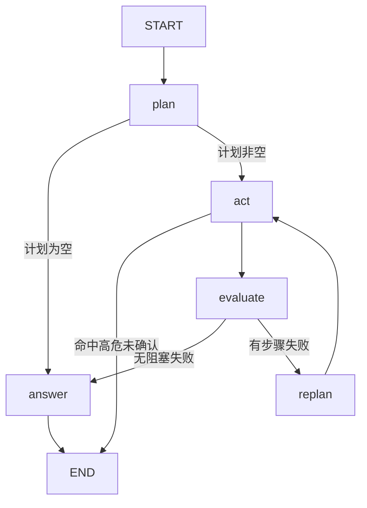

<p align="center">
  <strong>EnvoyMart · 智能电商平台</strong><br/>
  Spring Cloud 微服务 + LangChain4j Agent + Vue 3 全栈
</p>

<p align="center">
  <a href="https://github.com/YumeFusaka/EnvoyMart/actions/workflows/ci.yml"></a>
  
  
  
  
  
  
  
  
</p>

---

## 项目简介

EnvoyMart 是基于 Spring Cloud Alibaba + LangChain4j + Vue 3 的智能电商平台，覆盖用户、商品、订单、支付、物流、评价等核心业务，并在其上构建 Agent 能力：RAG 知识问答、多步工具编排、长期记忆、MCP 工具发布。

**工程重点不在于"接了个大模型"，而在于让 Agent 可观测、可评测、可降级。**

- **微服务底座**：Spring Cloud Alibaba（Nacos + Sentinel + Gateway），9 个 Maven 模块
- **网关限流**：Sentinel 按路由分档限流（AI 接口 5rps ~ 商品接口 100rps），阈值按「一次请求的代价」定，超限返回 429 与可读提示
- **Agent 编排层**：自研 `agent-core`（入口守卫 / LangGraph4j 执行图 / 循环护栏 / 工具注册 / 记忆 / RAG）
- **模型接入层**：LangChain4j `ChatModel` / `StreamingChatModel`，OpenAI 兼容协议；**对话走 DeepSeek V4.1 Flash、向量化与重排走百炼**（DeepSeek 无 embeddings 端点，故按能力拆供应商）
- **检索**：BM25 + 向量混合召回 → RRF 融合 → gte-rerank 精排；带 Hit Rate / MRR / NDCG 评测
- **记忆**：分两轨——结构化**用户画像**（固定槽位、覆盖式更新、全量注入）与**情节记忆**（自由文本、按 userId 隔离后语义召回）。冲突在写入时消解，过时按槽位类型分层处理
- **MCP**：把订单、物流、商品、取消订单能力以 MCP 协议对外发布，端点带鉴权
- **可靠性**：LoopGuard 统一约束循环预算、高危操作人工确认（HITL）、链路异常整体降级
- **可观测**：Micrometer + OTLP + Prometheus。业务指标按成本与失败面埋点——`agent_llm_latency` / `agent_llm_tokens`（按模型、按 prompt/completion 分向）、`agent_tool_calls`（按工具与 success/error/**blocked** 分类）、`agent_tool_latency`。护栏拦截计进指标，否则无从判断"预算过紧"还是"模型在失控"
- **成本模型（实测）**：连打 16 轮真实对话读 `agent_llm_tokens` 差量 → 平均 **3.7 次模型调用、2,565 prompt + 286 completion token/轮**，按 qwen-plus 阶梯价约 **0.26 分/轮**（万轮 ≈ ¥26）。**成本 78% 在输入侧**，所以降本第一刀是前缀缓存，不是压输出。详见 [docs/项目总览.md](docs/项目总览.md)
- **流式**：`/ai/chat/stream`（SSE），首字延迟只取决于首个 token 到达时间

## 系统架构

```
                        ┌──────────────────────────────┐
                        │      Vue 3 SPA 前端           │
                        │  商城 · 购物车 · AI 智能助手   │
                        └──────────────┬───────────────┘
                                       │ HTTP
                        ┌──────────────▼───────────────┐
                        │  API 网关 (Spring Cloud       │
                        │  Gateway + Sentinel)          │
                        │  JWT 鉴权 · 限流 · 路由       │
                        └──┬──────┬──────┬──────┬───────┘
                           │      │      │      │
                 ┌─────────┘      │      │      └─────────┐
                 ▼                ▼      ▼                ▼
          ┌────────────┐  ┌────────────┐ ┌────────────┐ ┌────────────┐
          │ 认证服务    │  │ 商品服务    │ │ 订单服务    │ │ AI 服务     │
          │ auth 9001  │  │ product    │ │ order 9003 │ │ ai 9004    │
          └────────────┘  │ 9002       │ └────────────┘ └─────┬──────┘
          ┌────────────┐  └────────────┘ ┌────────────┐        │
          │ 支付服务    │                 │ 评价服务    │ ┌──────▼──────┐
          │ payment    │                 │ review     │ │ agent-core  │
          │ 9005       │                 │ 9006       │ │ （编排层）   │
          └────────────┘                 └────────────┘ └──────┬──────┘
                                                               │
          ┌────────────────────────────────────────────────────▼──────┐
          │  基础设施：Nacos · Redis · RabbitMQ · ES 9 · MySQL · Milvus │
          └───────────────────────────────────────────────────────────┘
```

## 模块清单

| 模块 | 端口 | 说明 |
|------|------|------|
| `gateway-service` | 8080 | 网关：路由 + JWT 鉴权 + Sentinel 限流 |
| `auth-service` | 9001 | 用户认证与 JWT 签发 |
| `product-service` | 9002 | 商品 CRUD + ES 搜索 + Redis 热点缓存（三防 + 删除补偿） |
| `order-service` | 9003 | 订单与购物车 + Redisson 分布式锁 + RabbitMQ 事件 + Sentinel 熔断 |
| `ai-service` | 9004 | Agent 编排、RAG、记忆、MCP Server |
| `payment-service` | 9005 | 支付创建/回调 |
| `review-service` | 9006 | 商品评价 |
| `agent-core` | — | 自研 Agent 编排层（纯 Java 库，无 Spring 依赖） |
| `common` | — | 公共模块（Result / JWT / 异常处理 / 上下文透传 / MQ 生产端确认 / Feign 内部凭证） |

## Agent 执行链路

**外层是显式的图，节点内部才是模型自主** —— 不是"几种并列的推理模式"：

```
① 入口守卫：能不能确定？能确定就走确定性流程（业务判定零 LLM）
      ↓ 不能确定
② 执行图（LangGraph4j）：plan → act（按依赖分层，同层并发）→ evaluate → replan → answer
      图中"计划为空"时转为直接对话——节点内的 ReAct 工具循环就发生在那里
```



`GET /ai/graph` 可直接导出这张图的 mermaid，方便调试与讲解。

**意图路由的分工**：模型判语义（"退货政策第 3 条"与"订单 3 我要退货"的区别是语义的），规则验参数齐备（消息里是否真的给了订单号）。模型不可用时完全退回规则。

**循环护栏 LoopGuard**：一次请求一份，同时约束**图里的环**、**计划内步骤执行**与 **ReAct 工具循环**——最后一处就在 `LangChain4jLLMProvider` 的循环体内（护栏是循环里的局部变量，不经框架回调传递）。预算是工具调用总数、同一「工具+参数」重复次数、规划轮次三项。

**工具循环落在哪**：**在 `LangChain4jLLMProvider` 自己的代码里**——LangChain4j 的 `ChatModel.chat()` 不执行工具，官方要求调用方自己跑往返，所以循环、护栏、结果回填都在一处。`LLMProvider` 分了两条路径：`chat()` 单次（规划/分类/抽取，本就不该有工具）与 `chatWithTools()` 完整循环（ReAct）。

> （历史注记：本项目原用 Spring AI 2.0，它把工具执行循环收进 `ChatClient` 的 `ToolCallingAdvisor`——直接调 `ChatModel.call()` 时模型返回的 tool_call **不会被执行，也不报错**。那个静默失效的坑记在下面「踩过的坑」里。迁到 LangChain4j 后循环归调用方，"以为框架会执行"的误解空间从根上消失了。）

**ACT 的并发**：计划里带 `dependsOn`，同层步骤并发执行、有依赖的等前置完成。这是 ReAct 结构上做不到的——它每步都要看上一步结果，天然串行。批内单步有 15s 超时，超时按步骤失败处理，不会把整轮对话挂住。

**记忆**：分两轨——结构化画像（固定槽位、覆盖式更新、全量注入）与情节记忆（自由文本、按 userId 隔离后语义召回）。分轨的理由是两者存储要求相反：画像要全量注入因此必须有界，情节要什么都能记因此必须自由。

**身份不由模型提供**：`userId` 不在工具签名里，由执行上下文注入（Agent 路径来自网关注入的请求头，MCP 路径来自校验过的 JWT），缺失即 fail-closed。

**可靠性护栏**：模型/工具异常整体降级为可读回复；重排/嵌入失败自动回退；无模型 Key / 无 Milvus / 无注册中心均有降级路径。外部调用配超时，库存走原子更新，支付回调有状态机与验签，模型未接入时健康检查报告 `DEGRADED`。

## 检索评测（可复现）

**检索指标是中间指标**——召回到了正确文档，模型仍可能答错。所以除了下面这些，还有一层
`RagAnswerQualityTest` 直接评"用户拿到的回答"（21 条样本 + 裁判模型，需 API Key、本地跑）：

| 配置 | 忠实度(1-5) | 相关性(1-5) | 回答均长 | token/条 |
|------|-----------|-----------|---------|---------|
| 仅关键词 | 2.95 | 4.05 | 261 | 719 |
| 混合(+向量) | 3.10 | 4.19 | 282 | 777 |
| 混合+重排（线上配置） | **2.95** | 4.19 | 274 | 769 |
| 混合+重排 @5 | **2.81** | 4.05 | 335 | 906 |

> **结论反直觉，但如实记录**：Hit Rate 从 0.633 提到 0.850（+22pp），**回答质量几乎没动**——
> 四个配置的忠实度都卡在 3/5，说明"编造文档之外的内容"是**生成侧的系统性问题**，
> 检索配置怎么调都盖不住。@5 那行更明显：上下文更多、回答更长，**却更不忠实**。
>
> 边界：21 条样本，0.15 分的差距在噪声内；裁判与生成同一模型家族；只跑 RAG 路径，
> 不含工具与多轮记忆。

`RetrievalQualityTest` 用三档分层标注样本锁住检索质量（**90 篇语料、120 条样本、各档 40 条**，随机基线 **0.036**）：

| 样本组 | 条数 | Hit Rate@3 | MRR | 说明 |
|--------|------|-----------|-----|------|
| 字面重合 | 40 | 0.975 | 0.883 | 用户照抄文档用词，关键词检索的强项 |
| 口语改写 | 40 | 0.700 | 0.588 | 换种说法，部分词仍重合 |
| 语义鸿沟 | 40 | **0.225** | 0.225 | 查询与文档几乎无字面交集 |
| **全量** | **120** | **0.633** | **0.565** | |

> 语料**按主题成簇**（售后、物流、营销等九类各 6~14 篇），让同一条查询的候选里出现多篇语义相邻的文档——真实知识库就是这样，而不是一问一答。
>
> **一个被自己推翻的结论**：30 篇 / 30 条时曾写"语义鸿沟组低于随机基线（0.100 < 0.116）"。扩到 120 条后它不成立了——语义档 0.225，明显高于基线 0.036。根因在基线：30 篇取 top-3 时随机命中率本身就高（占语料 10%）。**小语料上的指标差距，可能整个来自基线而非被测对象。**

该测试的向量库是空的，**隔离测量的是关键词路的底线**。

**引入向量与重排后的对照**（`RetrievalComparisonTest`，本地跑）：

| 配置 | 字面 | 口语 | 语义 | 全量 | 可复现性 |
|------|------|------|------|------|---------|
| 仅关键词 | 0.975 | 0.700 | 0.225 | 0.633 | 三次一致 |
| 混合（+向量） | 0.950 | 0.925 | **0.625** | **0.833** | 三次一致 |
| 混合 + 重排 | 1.000 | 0.950 | 0.625 | 0.850 ~ 0.858 | 小幅波动 |

向量混合召回带来 **+20pp** 全量提升（语义档 +40pp、口语档 +22.5pp）——**这两组数字三次重复运行完全一致**。唯一负向是字面档 0.975 → 0.950（向量路引入了语义相邻但非目标的噪声），幅度小但如实记录。

**重排的价值在排序质量**：全量 Hit Rate 仅 +2.5pp，但 **MRR 从 0.708 提到 0.753**——Hit Rate 只看有没有命中、不看排第几。

> **一次被证伪的判断**：上一轮重排读数不可复现（0.867~0.900，同一次运行内部还自相矛盾）。当时给重排器加了生效/降级计数、实测 **60 次调用降级 0 次**，据此排除了"静默降级"。**这个结论是错的**——样本扩到 120 条后，240 次调用里 **193 次降级**。根因是 `DashScopeReranker` 默认超时 **5 秒**（面向单次交互设的），连打 240 次响应变慢就超时，而 `HttpTimeoutException.getMessage()` **返回 null**——一个错误信息本身为空的失败。超时放宽到 30 秒后降级归零、读数稳定。**"60 次降级 0 次"只排除了那个规模下的解释，却被当成了普适结论。** 完整分析见 [docs/检索效果对照实验结果.md](docs/检索效果对照实验结果.md)。

> 本夹具文档最长仅 50 余字符，**每篇恰好一个切片**。这解释了两件事：一是 `chunkId` 与 `docId` 取什么都
> 不影响结果（所以手工造切片时把两者设成同一个值，问题一直没暴露）；二是多切片导致 RRF 抬权的缺陷在这套语料上
> 永远测不出来，需要专门构造场景（`RrfMultiChunkTest`）。

## 快速启动

依赖 **JDK 21**（Boot 4.1 最低 17，本项目用 21）。注意 `JAVA_HOME` 指向更低版本时会报
`UnsupportedClassVersionError: class file version 65.0`——看起来像构建坏了，其实是运行时 JDK 比编译时低。

### 1. 准备密钥（只做一次）

```bash
cd backend
{
  printf 'export JWT_SECRET="%s"\n' "$(openssl rand -base64 48 | tr -d '\n')"
  printf 'export PAYMENT_CALLBACK_SECRET="%s"\n' "$(openssl rand -hex 32)"
  printf 'export INTERNAL_TOKEN="%s"\n' "$(openssl rand -hex 32)"
} > .env.local
```

三个密钥都是**缺失即拒绝启动**，刻意不设默认值——写在仓库里的默认密钥等于没有密钥。

| 变量 | 作用 |
|------|------|
| `JWT_SECRET` | 用户令牌的签发与校验 |
| `PAYMENT_CALLBACK_SECRET` | 支付回调的 HMAC 验签 |
| `INTERNAL_TOKEN` | 服务间调用的身份凭证：网关注入 `X-Internal-Token`，下游校验通过才认 `X-User-Id` |

**为什么写成文件而不是每次 `export`**：`JWT_SECRET` 必须让所有服务拿到**同一个值**。
按"每个终端各执行一次 `openssl rand`"来启动，gateway 与 auth-service 会拿到不同的密钥——
症状是「登录成功，但之后所有接口 401」，而 token 本身完全正常（拿到 ai-service 的 MCP 端点
甚至能验签通过），排查成本极高。

启动日志会打印**密钥指纹**（如 `[JWT] 密钥指纹=53700840`），各服务一致即说明配对了。

> **调试提示**：带了 `INTERNAL_TOKEN` 之后，直连服务端口（9001-9006）调用需要身份的接口会被拒
> （401「缺少服务间调用凭证」）——这正是它要防的。要直连调试就自己带上这个头：
> `curl -H "X-User-Id: u1001" -H "X-Internal-Token: $INTERNAL_TOKEN" http://127.0.0.1:9003/orders`

模型相关的变量见下方「AI 能力所需的模型配置」，也可以一并写进 `.env.local`。

### 2. 启动

```bash
docker compose up -d          # 基础设施（可选，缺失时服务自动降级）

cd backend
mvn clean install -DskipTests
./run-local.sh                # 启动全部服务并等待就绪
./run-local.sh stop           # 停止全部
./run-local.sh auth-service   # 只启动某一个
```

`run-local.sh` 会从 `backend/.env.local` 读取密钥并统一注入每个服务，
所以你不需要在多个终端里手动对齐环境变量。

<details>
<summary>链路追踪（SkyWalking，可选）</summary>

`docker compose up -d` 会一并起 OAP 与 UI（UI 在 `http://localhost:8088`），但有两样东西不在镜像里，需要先手工准备一次（两个目录都已 gitignore）：

```bash
# 1. OAP 存储用本机 MySQL，库要事先建好（表由 OAP 自动建）
mysql -u root -p -e "CREATE DATABASE IF NOT EXISTS skywalking"

# 2. OAP 镜像自带 PostgreSQL 驱动、没带 MySQL 的，从本地 maven 仓库拷进去
mkdir -p skywalking-libs && cp ~/.m2/repository/com/mysql/mysql-connector-j/*/mysql-connector-j-*.jar skywalking-libs/

# 3. javaagent 从镜像里提取一次（后端启动时由 run-local.sh 自动带上）
mkdir -p skywalking-agent && docker create --name sw-tmp apache/skywalking-java-agent:9.4.0-java21 \
  && docker cp sw-tmp:/skywalking/agent/. skywalking-agent/ && docker rm sw-tmp
```

**`docker-compose.yml` 里给 OAP 设的 `SW_HEALTH_CHECKER: default` 不要删**：OAP 的 health-checker 模块默认不加载，缺了它 12800 上就没有 `/healthcheck`；而 UI 的 Armeria 客户端探不到健康端点会把每个请求**挂起等判定**——表现是 UI 一直转圈、OAP 日志记到十几秒后 `Broken pipe`，**而 OAP 本身完全正常**。

`run-local.sh` 会把 agent 同步到 `$HOME/.envoymart/skywalking-agent` 再启动——
**不能直接用仓库里的路径**：`-javaagent` 走完 Maven 的参数拼接后非 ASCII 字符会变成乱码，
而上级目录「面试训练」拿不到 8.3 短名，只能用纯 ASCII 的落地路径绕开。

**压测时可以关掉**：`ENVOYMART_SKYWALKING=off ./run-local.sh`。
javaagent 逐方法插桩，关掉才能拿到"除掉观测之后还剩多少"的干净数字。
但它是**为了取准数字**，不是为了避免故障——曾经以为它会把并发下单的成功数从 10 拉到 3，
后来查明那是压测脚本自己不是幂等（购物车跨轮次累加）。修掉之后，开关追踪都是稳定 10 单。

</details>


<details>
<summary>手动逐个启动（不用脚本时）</summary>

```bash
cd backend
set -a; source .env.local; set +a     # 每个服务都用同一个 .env.local
mvn -pl gateway-service spring-boot:run   # 依次启动 gateway / auth / product / order / ai / payment / review
```

</details>

### 3. 前端

```bash
cd frontend && pnpm install && pnpm dev
```

**AI 能力所需的模型配置**（不配也能启动，会自动回退到 Mock 模型）：

```bash
# 对话与向量化可来自不同供应商：DeepSeek 没有 embeddings 端点，向量化留在百炼
export LLM_API_KEY=<DeepSeek Key>          # 对话
export LLM_MODEL=deepseek-flash
export EMBEDDING_API_KEY=<百炼 Key>        # 向量化与重排
export LLM_EMBEDDING_MODEL=text-embedding-v4
# 可选：接入 Milvus 作为向量库（run-local.sh 已为 ai-service 带上这个 profile）
export SPRING_PROFILES_ACTIVE=milvus

# 支付回调验签密钥（不配则回调一律被拒——资金入口 fail-closed，不会放宽）
# 渠道侧约定：X-Pay-Signature = hex(HMAC-SHA256(secret, orderId|transactionNo|status))
export PAYMENT_CALLBACK_SECRET=<随机密钥>
```

访问地址：
- 前端：`http://localhost:5173`
- API 网关：`http://localhost:8080`
- 接口文档：`http://localhost:9001/swagger-ui/index.html`（各服务同路径）
- MCP 端点：`http://localhost:9004/mcp`（Streamable HTTP）
- 指标：`http://localhost:9004/actuator/prometheus`
- 链路追踪 UI：`http://localhost:8088`（SkyWalking）

## 容器化部署（k3s + GitOps）

上面是**本地开发**的启动方式。**部署到 Kubernetes** 走另一条链路：

```
push 到 main
      ↓  GitHub Actions
  构建镜像（多阶段构建，tag = commit SHA）→ 推 ghcr.io
      ↓
  CI 把新 tag 写进 k8s/ 清单并提交
      ↓  Argo CD（跑在集群里）监测到变化
    拉取 → 渲染 → 应用
      ↓
   Pod 滚动更新
```

**为什么让 Argo CD 拉、而不是 CI 里直接 `kubectl`**：

- **CI 不持有集群凭据** —— 直接 `kubectl` 得把 `kubeconfig` 存成 GitHub Secret，等于把集群写权限交给了别人的 runner
- **回滚即 `git revert`** —— 集群状态与 Git 一一对应；CI 脚本里的 `kubectl set image` 执行完就没了
- **自动收敛** —— 有人手改集群，Argo CD 会把它改回 Git 里的样子

**怎么验证「线上跑的是哪个版本」**：镜像构建时注入 commit SHA，`GET /actuator/info` 可直接查——
排查问题时把**本地 HEAD、部署的镜像 tag、接口返回的 build-sha** 三者比对即可。这也是端到端验证链路时用的方法。

**前置条件**：一台能跑 k3s 的机器 + 一个镜像仓库（本仓库用 ghcr.io 的公开包，集群拉取无需认证）。

清单在 `k8s/`，构建定义在 `backend/Dockerfile`（一份 Dockerfile 构建所有服务，靠 `--build-arg SERVICE=xxx` 切换）。

## 技术栈

| 类别 | 技术 |
|------|------|
| 语言 | Java 21, TypeScript |
| 微服务 | Spring Boot 4.1.1, Spring Cloud 2025.1.3, Spring Cloud Alibaba 2025.1.0.0 |
| AI 框架 | LangChain4j 1.20.0（ChatModel / StreamingChatModel / EmbeddingModel）+ MCP Java SDK 2.0.1 |
| Agent 图 | LangGraph4j 1.8.27（LangGraph 的 Java 实现，零 Spring 依赖） |
| Agent | 自研 agent-core：入口守卫、执行图编排、循环护栏、ToolRegistry |
| 检索 | BM25 + 向量混合召回、RRF 融合、gte-rerank 精排、Hit Rate/MRR/NDCG 评测 |
| 向量库 | Milvus（生产）/ 内存 IVF 索引（本地降级） |
| 记忆 | LLM 事实抽取 + 向量语义召回，知识与记忆分库隔离；**会话窗口落 Redis**（跨重启、跨实例） |
| 可观测 | **SkyWalking 10.2**（javaagent，覆盖全部 7 个服务）+ Micrometer Tracing + OTLP + Prometheus |
| 熔断降级 | Sentinel `DegradeRule`（慢调用比例 + 异常比例）；扣库存被熔断后**快速失败**，不降级为成功 |
| 分布式事务 | Seata 2.5 AT（`@GlobalTransactional`）提供崩溃可恢复的跨服务回滚；另有手写 Saga（显式记账 + 反序补偿）。两者的取舍见 `docker-compose.yml` 的注释 |
| 数据库 | MySQL 8.4 / H2（本地） |
| ORM | MyBatis-Plus 3.5.17 |
| 缓存 | **两级**：Caffeine 本地（热点 key 不产生网络往返）+ Redis 7.4；失效走 pub/sub 广播，本地 TTL 兜底。穿透用**布隆过滤器 + 空值哨兵**两道，雪崩用 TTL 抖动，击穿用 SETNX 互斥；Redis 不可用时读路径降级查库 + 熔断，删除失败落 MQ 补偿重试 |
| 消息队列 | RabbitMQ 4.1（生产端 confirm + returns，消费端死信队列 + 重试） |
| 搜索引擎 | Elasticsearch 9.4.5 |
| 前端 | Vue 3.5, Vite 8, Element Plus, Pinia, Axios |
| 接口文档 | springdoc-openapi 3.1.1 |
| 交付 | **Docker 多阶段构建**（运行镜像只含 JRE + jar）+ **k3s** 编排（Deployment / Service / ConfigMap / Secret，含就绪探针）；**Argo CD** 做 GitOps 发布——CI 只把新镜像 tag 写进 `k8s/` 清单，集群侧自动同步，**CI 全程不持有集群凭据**。镜像 tag 绑 commit SHA，可追溯、回滚即 `git revert` |
| 鉴权 | jjwt 0.13 |
| 包管理 | Maven, pnpm |

## 项目结构

```
EnvoyMart/
├── .github/workflows/          # CI（测试 + 构建）· Deploy（构建镜像 + 更新 k8s 清单）
├── docker-compose.yml
├── k8s/                        # Kubernetes 清单 —— Argo CD 监测此目录并自动同步
│   └── auth-service.yaml       # ConfigMap / Deployment（含就绪探针）/ Service
├── backend/
│   ├── pom.xml                 # 聚合 POM（Boot 4.1.1 + LangChain4j 1.20.0）
│   ├── Dockerfile              # 一份构建所有服务（--build-arg SERVICE=xxx）
│   ├── common/                 # Result / JWT / 异常处理 / 身份透传
│   ├── gateway-service/
│   ├── auth-service/
│   ├── product-service/
│   ├── order-service/
│   ├── payment-service/
│   ├── review-service/
│   ├── agent-core/             # 自研 Agent 编排层
│   │   └── src/main/java/.../agent/
│   │       ├── core/           # Agent(入口守卫) / AgentGraph(执行图)
│   │       ├── llm/            # LLMProvider 契约、PlanStep、ToolExecution
│   │       ├── memory/         # 短期/长期记忆与固化器（窗口持久化契约）
│   │       ├── rag/            # 分词、混合检索、重排、向量库、评测器
│   │       ├── flow/           # DeterministicFlow / IntentRouter
│   │       ├── loop/           # LoopGuard / LoopBudget
│   │       └── tool/           # Tool / ToolRegistry / MCP 适配
│   └── ai-service/             # Agent 装配、LangChain4j 接入、MCP Server、记忆与 RAG 实现
├── frontend/
│   └── src/                    # 页面 / 组件 / API / 状态管理
└── docs/
    └── 项目总览.md              # 技术栈 · 结构 · 设计 · 亮点 · 实现顺序
```

## License

MIT © 2025-2026 YumeFusaka
