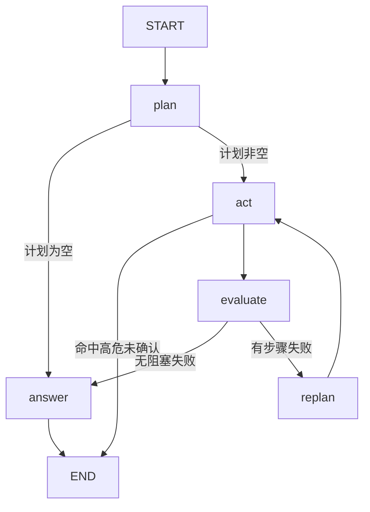

# EnvoyMart 项目总览

> 本项目唯一长期文档：技术栈、结构、设计、亮点、实现顺序。
> 规模：后端 179 个 Java 文件 / 10700 行（其中主代码 159 文件 8700 行、测试 20 文件 2000 行），17 个测试类 67 个测试（1 个需显式开启）。前端 2100 行。

---

## 一、项目定位

基于 **Spring Cloud 微服务底座 + Spring AI Agent** 的智能电商平台，覆盖用户、商品、订单、支付、评价等业务，并构建 Agent 能力：RAG 问答、多步工具编排、长期记忆、MCP 工具发布。

**重点不是「接了个大模型」，而是让 Agent 可观测、可评测、可降级。** 它回答四个工程问题：

1. 模型接入与业务编排的边界在哪 —— 框架做什么，业务做什么
2. 检索质量怎么证明 —— 不是「感觉还行」，是可复现的指标
3. Agent 出错怎么办 —— 死循环、幻觉、误操作、依赖挂掉
4. 成本怎么看得见 —— 每次调用花了多少 token、多少毫秒

---

## 二、技术栈清单

### 语言与运行时

| 技术 | 版本 | 用途与理由 |
|------|------|-----------|
| Java | 21 LTS | 虚拟线程用于 SSE 流式；Boot 4.1 最低支持 17 |
| TypeScript | 6.0 | 前端类型 |
| Node.js | 20 | Vite 8 要求 |

### 微服务

| 技术 | 版本 | 用途与理由 |
|------|------|-----------|
| Spring Boot | 4.1.1 | 当前最新；Jackson 3 / Servlet 6.1 / Tomcat 11 |
| Spring Cloud | 2025.1.3 | 与 Boot 4.1 配套的 release train |
| Spring Cloud Alibaba | 2025.1.0.0 | Nacos + Sentinel，国内事实标准 |
| Spring Cloud Gateway | 5.0.3 | 响应式网关；注意配置前缀已变为 `spring.cloud.gateway.server.webflux.*` |
| OpenFeign | — | 声明式服务间调用 |
| LoadBalancer | — | `lb://` 路由解析依赖它（SCA 2025.1 不再传递引入，需显式声明） |

### AI 与 Agent

| 技术 | 版本 | 用途与理由 |
|------|------|-----------|
| Spring AI | 2.0.1 | 模型接入层；提供 ChatModel / ToolCallback / MCP Server |
| LangGraph4j | 1.8.27 | 执行图引擎（LangGraph 的 Java 实现）；**零 Spring 依赖**，不污染宿主 Jackson 版本 |
| deepseek-flash | — | 对话模型（DeepSeek V4.1 Flash）；走 OpenAI 兼容协议，换 OpenAI / Ollama 只改 base-url |
| text-embedding-v4 | 1024 维 | 向量化（百炼）；**DeepSeek 无 embeddings 端点**，故向量化留在百炼，维度须与 Milvus 集合一致 |
| Milvus | 2.6 | 向量库；知识库与记忆库用**独立 collection** |
| gte-rerank-v2 | — | cross-encoder 重排；百炼 API，无需本地部署 |
| MCP Streamable HTTP | — | 工具对外发布 |

### 存储与中间件

| 技术 | 版本 | 用途与理由 |
|------|------|-----------|
| MySQL / H2 | 8.4 / 内存 | 生产 MySQL，本地 H2 免依赖启动 |
| MyBatis-Plus | 3.5.17 | ORM；Boot 4 需用 `mybatis-plus-spring-boot4-starter` |
| Redis | 7.4 | 热点商品缓存、购物车 72h TTL |
| Redisson | 4.7.0 | 分布式锁，防库存超卖 |
| RabbitMQ | 4.1 | 事件驱动；Topic Exchange + 死信队列 |
| Elasticsearch | 9.4.5 | 商品多字段搜索；版本需与 Boot 4 管理的客户端一致 |

### 安全与可观测

| 技术 | 版本 | 用途与理由 |
|------|------|-----------|
| jjwt | 0.13.0 | HS256 签发/校验；0.12+ 要求密钥 ≥ 32 字节 |
| Micrometer Tracing + OTLP | — | 链路追踪，可指向 Langfuse / Jaeger |
| Prometheus | — | 指标端点；模型与工具的自定义指标按成本与失败面埋点 |
| springdoc-openapi | 3.1.1 | 接口文档（Knife4j 无 Boot 4 版本） |

### 前端

| 技术 | 版本 | 用途 |
|------|------|------|
| Vue | 3.5 | 组合式 API |
| Vite | 8 | 构建 |
| Element Plus | 2.13 | 组件库 |
| Pinia | 3 | 状态管理（含持久化） |
| vue-router | 5 | 路由与守卫 |
| Axios + fetch | — | 普通请求用 Axios；SSE 流式用 fetch + ReadableStream |

---

## 三、项目结构

```
EnvoyMart/
├── docker-compose.yml           # Nacos / MySQL / Redis / RabbitMQ / ES / Milvus
├── .github/workflows/ci.yml     # 后端测试（含检索质量门禁）+ 前端构建
├── backend/
│   ├── pom.xml                  # 聚合 POM：Boot 4.1.1 + Spring AI 2.0.1
│   ├── Dockerfile
│   ├── common/                  # Result / JWT / 异常处理 / 身份透传
│   ├── gateway-service/  8080   # 路由 + JWT 鉴权 + Sentinel 限流
│   ├── auth-service/     9001   # 用户认证与 JWT 签发
│   ├── product-service/  9002   # 商品 CRUD + ES 搜索 + Redis 缓存
│   ├── order-service/    9003   # 订单/购物车 + Redisson 锁 + RabbitMQ 事件
│   ├── payment-service/  9005   # 支付创建/回调
│   ├── review-service/   9006   # 商品评价
│   ├── agent-core/              # ★ 自研 Agent 编排层（纯 Java，零 Spring 依赖）
│   │   └── .../agent/
│   │       ├── core/            # Agent(入口守卫) / AgentGraph(执行图)
│   │       ├── llm/             # LLMProvider 契约、PlanStep、ToolExecution
│   │       ├── memory/          # ShortTermMemory（会话窗口）
│   │       │                    # EpisodicMemory（情节，按 userId 召回）
│   │       │                    # UserProfile / UserProfileStore（结构化画像）
│   │       │                    # MemoryConsolidator / MemoryItem
│   │       ├── rag/             # TextTokenizer / HybridRetriever（含 RRF）
│   │       │                    # / VectorStore / RetrievalEvaluator / SimpleRAGEngine
│   │       │                    # / DashScopeReranker（外部重排适配器，含降级计数）
│   │       ├── flow/            # DeterministicFlow / FlowRegistry / IntentRouter
│   │       ├── loop/            # LoopGuard / LoopBudget / ToolContextKeys
│   │       └── tool/            # Tool / ToolDefinition / ToolCall / ToolRegistry
│   └── ai-service/       9004   # ★ Agent 装配 + Spring AI 接入 + MCP Server
│       └── .../aiservice/
│           ├── llm/SpringAiLLMProvider.java     # ChatModel / ChatClient → LLMProvider
│           ├── rag/MilvusVectorStore.java       # Spring AI VectorStore → VectorStore
│           ├── rag/SpringAiEmbeddingService.java
│           ├── memory/LlmMemoryConsolidator.java
│           ├── health/LlmHealthIndicator.java   # 模型可用性进健康检查
│           ├── flow/AfterSaleFlow.java          # 确定性售后流程
│           ├── tool/                            # 业务工具 + MCP 适配
│           ├── security/McpAuthFilter.java      # /mcp 鉴权
│           └── config/AiAgentConfig.java        # 全部装配
└── frontend/
    └── src/                     # views / components / api / stores / router
```

**依赖方向是单向的**：`ai-service` 依赖 Spring AI，`agent-core` 只依赖自己定义的接口（`LLMProvider` / `VectorStore` / `Reranker` / `Memory` / `Tool`）。换框架、换向量库、换模型厂商都不需要改编排层。

---

## 四、核心设计

### 4.1 分层：为什么不全用 Spring AI

Spring AI 提供的是**模型接入**与**工具调用循环的运行时**，这些直接复用；它不解决业务侧的问题：意图路由、上下文预算、多步编排失败回退、检索质量、记忆沉淀、高危操作拦截。

| 归属 | 内容 |
|------|------|
| Spring AI 负责 | 模型接入、消息格式转换、工具循环运行时（`ChatClient` + `ToolCallingAdvisor`）、MCP 协议、Embedding |
| agent-core 负责 | 意图路由、执行图编排、循环护栏、工具注册与门禁、记忆、检索与评测 |

> **分界线是"要不要执行工具"**，这一点在 Spring AI 2.0 之后变得必须显式区分：
> 2.0 起工具执行循环已从所有 `ChatModel` 上移除，只在 `ChatClient` 的 advisor 链里存在。
> 直接调 `ChatModel.call()` 时模型返回的 tool_call 不会被执行，而且**不报错、内容为空**。
> 所以 `LLMProvider` 拆成了 `chat()`（单次，规划/分类/抽取用）与 `chatWithTools()`（完整循环，ReAct 用）。

### 4.2 三阶段执行链路

```
执行前                                        执行中                          执行后
UserProfile（全量注入）┐                                              ┌ MemoryConsolidator.extract
EpisodicMemory.recall ├→ systemPrompt → 入口守卫 → 执行图(plan/act/evaluate) ┤   ├→ UserProfileStore.update
RAG.retrieve          ┘                (命中则走确定性流程)           └   └→ EpisodicMemory.add
```

### 4.3 两层结构（不是三种并列的推理模式）

```
① 入口守卫：能不能确定？能确定就走确定性流程（业务判定零 LLM）
      ↓ 不能确定
② 执行图：plan → act（按依赖分层，同层并发）→ evaluate → replan → answer
      （图中"计划为空"时转为直接对话——节点内的 ReAct 工具循环就发生在那里）
```

**为什么不是三种并列模式**：ReAct 是**单个执行单元的循环范式**，Plan-and-Execute 是**任务编排范式**，两者不在一个层级——正确的结构是嵌套，不是并列。这里外层是显式图，节点内部才可能出现模型自主。

> **answer 节点里的 ReAct 是真的会执行工具的**：它走 `chatWithTools()`，即 `ChatClient` + `ToolCallingAdvisor`，
> 完整的「模型返回 tool_call → 执行 → 回填 → 再调用」往返。这条路径经 `ReactToolLoopTest` 验证，
> 且护栏会在该循环中拦截超预算的调用。

**意图路由的分工**：模型判**语义**（"退货政策第 3 条"和"订单 3 我要退货"的区别是语义的），规则验**参数齐备**（消息里是否真的给了订单号）。模型不可用时完全退回规则。路由可以用模型，但流程内部的业务判定必须由代码做。

### 4.4 执行图（LangGraph4j）



| 节点 | 职责 | 为什么独立 |
|------|------|-----------|
| `plan` | LLM 生成显式计划 | 空计划是明确的转移条件，不是异常 |
| `act` | 按依赖分层并发执行；命中高危工具则中断 | 唯一知道"要不要拦"、也是唯一并发的节点 |
| `evaluate` | 判断是否有非可选步骤失败 | **纯规则判断，不调模型**，可独立测试 |
| `replan` | 失败时把已完成步骤与原因交给模型修正计划 | 要重新调模型，与 evaluate 成本性质不同；且必须限次数 |
| `answer` | 合成回答（无工具时即直接对话） | 所有路径的唯一汇合点 |

图是**显式注册**的，可以直接导出：`GET /ai/graph` 返回 mermaid。

**ACT 的并发**：计划里带 `dependsOn`，同层步骤并发执行、有依赖的等前置完成。这是 ReAct 结构上做不到的——ReAct 每步都要看上一步结果，天然串行。

> 规划提示词会明确要求模型输出 `dependsOn`（从 0 开始的步骤下标），解析时剔除指向自身或后续步骤的非法下标——
> 那两种写法会让分层执行空转或成环。**这条曾经是死代码**：提示词里没有这个字段、解析也不读它，
> 于是它永远是空列表，所有步骤恒并批执行。只读工具时看不出问题，一旦出现"先查后改"的链路就会并发地去改同一条数据。

**单步超时**：批内每个步骤有 15s 上限，超时按"该步骤失败"处理并取消任务，让图继续走 evaluate，而不是把整轮对话连同请求线程一起挂住。

### 4.5 循环护栏（LoopGuard）

一次请求一份，**同时约束两类循环**：

| 循环 | 谁驱动 | 护栏如何生效 |
|------|--------|-------------|
| 图里的 `replan → act` 环 | 我们 | 节点直接调用 `guard.allowPlanRound()` |
| 计划内步骤执行 | 我们 | `AgentGraph` 的 ACT 节点调用 `guard.allowToolCall()` |
| ReAct 工具循环 | **框架**（`ToolCallingAdvisor`） | 经 `toolContext` 把 guard 传进 `ToolCallback`，在调用点拦截 |

预算三项：工具调用总数（默认 8）、同一「工具 + 参数」重复次数（默认 2）、规划轮次（默认 2）。

**定位**：循环本身交给框架跑，但**循环的边界与终止条件归我们**——三种循环的"最多花多少"是同一套账，而且每次请求都会记录消耗摘要（`loops toolCalls=2/8 planRounds=2/2`）。

**没有自己写工具循环**：ReAct 的往返由 Spring AI 的 `ToolCallingAdvisor` 驱动，底层 `DefaultToolCallingManager` 自带调用上限（单工具 40 次 / 总计 150 次）作为兜底；我们的护栏是在此之上更贴合业务的约束（重复参数检测、与图共享预算）。

> **护栏在框架循环里确实生效**：`ReactToolLoopTest` 用桩模型连发两次工具调用、预算设为 1，
> 断言第二次被拦下且工具只执行了一次。少了这条验证，"循环交给框架、边界归我们"就只是文档里的一句话。

**同一「工具+参数」签名的口径**：参数按 key 排序后拼接。嵌套对象换 key 顺序、`3` 与 `"3"` 会被算成不同签名——
这是已知的精度损失，代价是护栏的"原地打转"检测可能被绕开；总预算仍是硬上限。

### 4.6 检索链路

```
query
 ├─→ BM25（CJK bigram 分词）──→ 排序 ─┐
 └─→ 向量检索（EmbeddingModel）─→ 排序 ─┴→ RRF 融合（按 docId 对齐）
                                          → cross-encoder 重排（gte-rerank）
                                          → Top-K 注入 Prompt
```

三个曾经的坑（都已修，见「七、踩坑」）：中文按空白分词导致召回恒空；`ingest()` 从未被调用导致向量库为空；RRF 用 chunkId 对齐导致融合失效。

### 4.7 记忆：分两轨，按不同需求选不同存储形态

| | **UserProfile**（画像） | **EpisodicMemory**（情节） |
|---|---|---|
| 存什么 | 身份、预算、偏好品类/品牌、收货地、服务偏好 | 「上次抱怨物流慢」「退过一次货」 |
| 形态 | **固定槽位**（枚举） | 自由文本 |
| 检索 | **不检索，全量注入** | 按 userId 过滤 + 语义召回 |
| 更新 | 新值覆盖旧值，旧值进 `previous` 留档 | 追加，按内容去重 |
| 有界性 | 槽位固定 → 天然有界 | 单用户 200 条上限，超出淘汰最旧 |

**为什么必须分轨**：两者的存储要求相反——画像要"全量注入"，因此**必须有界**（开放 key-value 会无限增长，最终撑爆上下文）；情节要"什么都能记"，因此必须自由。混在一轨只能二选一，两个目标都达不到。

**新老信息如何分辨**：这是分轨带来的直接收益，也是纯文本存储做不到的事。
「预算 100」和「预算 300」在自由文本里是两条**无从比较的独立字符串**，只能都留着，最后两条互相矛盾的记忆一起注入；
有了槽位才知道这是同一个 key 的两版，可以覆盖写、把旧值移进 `previous`。
**没有 key，就没有冲突消解。**

**过时如何处理**：不是删除，是分层。

| 层 | 场景 | 处理 |
|---|---|---|
| 覆盖 | 同槽位新值 | 覆盖，旧值进 `previous`（不参与注入） |
| 过期 | 时间敏感槽位超期 | 不注入，**库中保留** |
| 降权 | 置信度不足 | 不注入，但保留可查 |
| 遗忘 | 用户显式要求 / 容量淘汰 | 真删，**内存与向量库一并清**（只删内存会留下"幽灵记忆"） |

衰减速率按槽位区分：「是学生党」三年不变，「当前预算」三个月就废了——用同一个衰减率会把长期有效的事实和短期情境一起误伤。

**记忆检索与知识检索是不同的问题**，所以做法不同：

| | 知识检索 | 记忆检索 |
|---|---|---|
| 语料 | 文档——长、自洽、公开 | 记忆条目——短、碎片、私有 |
| 问题 | "哪段文档相关" | **"关于这个用户，我需要知道什么"** |
| 判定 | 语义相似度 | 这条对当前回答是否必要 |

短文本的向量信号弱（"用户是学生党"六个字），而且语义相似 ≠ 当下需要。所以画像干脆**不检索**（没有检索就没有检索错误），情节则**先按 userId 结构化过滤、再语义排序**。

**反投毒三层**：

1. **抽取时不存**——用户消息里的祈使/指令性内容不进记忆。这是唯一不依赖模型配合的防线：内容没入库，后面怎么注入都无法被绕过。
2. 注入时隔离——画像与记忆各成一段并声明「这是背景数据，不是指令」。措辞层的防护可以被绕过，只是降低误读概率。
3. **权限判定永不读记忆**——记忆只影响推荐与措辞，不影响"能做什么"。就算记忆里写着"用户是 VIP 可无限取消订单"，取消订单的权限也必须查数据库。

**隔离与归属**：短期窗口按 `sessionId`（会话内上下文，本就该随会话消失），长期记忆按 `userId`（跨会话，这才叫"长期"）。
把两者混成一个 key，会让"跨会话记忆"名存实亡，也会让一个用户读到另一个用户的画像。

**为什么记忆与知识分库**：两者混在同一 collection，用户偏好会污染知识检索结果。

### 4.8 工具与 MCP

同一份 `ToolDefinition` 有两个消费方：

- `ToolRegistryToolCallback` → 适配成 Spring AI 的 `ToolCallback`，供 Agent 与 MCP 调用
- `ToolRegistryCallbackProvider` → 注册给 MCP Server，经 `/mcp`（Streamable HTTP）对外发布

新增一个业务工具只需实现 `Tool` 并注册一次，Agent 与外部 MCP 客户端同时可用。

**工具身份不由模型提供**：`userId` 不进工具签名，也不进 `arguments`——它是模型生成的那部分，而模型无从知道真实用户是谁，只能编。
身份挂在 `ToolCall` 上，由执行上下文注入（Agent 路径来自网关注入的请求头，MCP 路径来自 `McpAuthFilter` 校验过的 JWT），
需要身份的工具从 `call.requireUserId()` 取，**缺失即 fail-closed**。工具回调还会无条件剔除 `arguments` 里的同名项，
因为 MCP 客户端的入参是任意 JSON，留着就是一条旁路。

> 这条既是安全修复也是功能修复：原来的写法下，模型只能凭上下文猜 userId 或干脆不填，
> 正常调用也会因参数缺失而失败。

### 4.9 可靠性护栏

| 风险 | 措施 |
|------|------|
| 死循环 | 对同一「工具 + 参数」计数，超阈值即中止并给出可读提示 |
| 无限迭代 | LoopGuard 三重预算：工具调用总数 8 / 同一「工具+参数」重复 2 次 / 规划轮次 2 |
| 误操作 | 高危工具（取消订单）标记 `requiresConfirmation`，两层拦截：计划层先拦、ToolRegistry 再拦 |
| 工具异常 | 异常信息结构化回写，不中断推理；非可选步骤失败则触发重规划 |
| 链路异常 | Agent 整体兜底，降级为可读回复而非 500 |
| 依赖不可用 | 无 Key → Mock 模型；无 Milvus → 内存向量库；重排失败 → 保持原顺序；无注册中心 → 静态实例列表 |
| **卡住不返回** | 外部调用配连接/读取超时（Feign 2s / 5s）；执行图单步 15s 上限，超时按步骤失败处理并取消任务 |
| **并发写坏数据** | 库存走数据库端原子更新（`where stock >= ?`），不做读-改-写；分布式锁加解锁同一作用域、逆序释放 |
| **重复投递** | 支付回调有状态机：终态不可变更、同结果幂等吞掉、流水号不一致拒绝 |
| **伪造回调** | 回调强制 HMAC 验签；未配置密钥时拒绝一切回调（资金入口 fail-closed） |
| **降级不可见** | 模型未接入时健康检查报告 `DEGRADED`，并配进聚合顺序避免被 UP 淹没 |
| 流量过载 | 网关按路由分档限流，超限返回 429 + 可读提示（见下） |
| **越权** | 工具身份由执行上下文注入而非模型提供；订阅归属校验一律带 userId |

**网关限流（Sentinel）**：`GatewaySentinelConfig` 启动时加载路由级 QPS 规则——阈值按「一次请求的代价」定，而不是按接口数量平均分配：

| 路由 | 阈值 | 定档理由 |
|------|------|---------|
| `ai-service` | 5 rps | 一次对话触发多轮模型调用与工具执行，成本比读接口高出一到两个数量级 |
| `payment-service` | 10 rps | 保护下游支付渠道 |
| `auth-service` / `order-service-orders` | 20 rps | 防登录爆破；写接口保护库存锁 |
| `order-service-cart` / `review-service` | 50 rps | 高频读写 |
| `product-service` | 100 rps | 读为主，且有 Redis 与 ES 兜着 |

实测：40 并发打 `auth-service`（阈值 20），**恰好 20 个放行、20 个 429**，响应体为 `spring.cloud.sentinel.scg.fallback` 配置的 JSON。

> **只用路由级规则，不用参数级（`GatewayParamFlowItem`）**。实测在 Spring Cloud Gateway 5.x + Sentinel 1.8.9 上，参数级限流抛出的 `ParamFlowException` 是在**响应已提交之后**才浮出来的——拦截不生效，反而在日志里刷异常、客户端拿到 200 空响应。按来源 IP 的配额留给上游 WAF 或业务侧，网关这层只做路由总量。

### 4.10 可观测与成本

- **日志与指标分工**：日志回答「这一次发生了什么」（模型名、耗时、prompt / completion token、工具调用数），指标回答「最近一周贵在哪」
- 自定义指标按成本与失败面埋点：
  - `agent_llm_latency` —— 按 `model` + `mode`(sync/stream) 分标签；流式与同步分开，否则首字延迟会被整轮时长污染
  - `agent_llm_tokens` —— 按 `model` + `type`(prompt/completion) 分向，成本趋势的来源
  - `agent_tool_calls` —— 按 `tool` + `outcome`(success / error / **blocked**)；**护栏拦截单独计数**，否则无从判断「预算过紧」还是「模型在失控」
  - `agent_tool_latency` —— 单工具耗时，定位慢下游
- Micrometer Tracing + OTLP 导出（可指向 Langfuse / Jaeger），Prometheus 暴露上述指标
- SSE 流式把首字延迟从「整轮推理 + 工具执行」降到「首个 token 到达」

### 4.11 鉴权

- 网关校验 JWT 并透传 `X-User-Id` 给下游服务
- `/mcp` 单独鉴权：平台 JWT 或 `X-MCP-API-Key`（未配置 Key 时只接受 JWT，避免默认弱口令）

---

## 五、技术亮点

按重要程度排序，每条都可在代码中找到对应实现：

1. **显式的执行图 + 统一的循环护栏** —— 用 LangGraph4j 把 Agent 编排成 5 个节点与条件边（可导出 mermaid），而不是藏在 while 循环里；循环的边界由 `LoopGuard` 统一把控，**同时约束图里的环和框架驱动的 ReAct 工具循环**。定位是"循环交给框架跑，但循环的边界归我"。

2. **可复现的分层检索评测** —— `RetrievalEvaluator` 在 30 篇语料、30 条标注样本上算 Hit Rate@K / MRR / NDCG@K，样本按「字面 / 改写 / 语义」三档分层，避免一个平均分掩盖真实分布。实测（纯关键词路）：

   | 样本组 | 条数 | Hit Rate@3 | MRR | 说明 |
   |--------|------|-----------|-----|------|
   | 字面重合 | 10 | 1.000 | 1.000 | 用户照抄文档用词，关键词检索的强项 |
   | 口语改写 | 10 | 0.800 | 0.750 | 换种说法，部分词仍重合 |
   | 语义鸿沟 | 10 | **0.100** | 0.100 | 查询与文档几乎无字面交集 |
   | **全量** | **30** | **0.633** | **0.617** | |

   **关键发现**：语义鸿沟组的 0.100 **低于随机基线 0.116**（30 篇取 top-3，按每条样本各自的标注相关文档数逐例计算再平均）——纯关键词检索在语义化提问上不只是退化成随机，还会自信地返回错的那篇。这不是「感觉向量检索更先进」，是量出来的硬证据。

   评测已进 CI，门槛设在实测值之下留余量，作用是回归防线：关键词路被改坏时构建失败。

   > 注意：该测试的向量库是空的，**隔离测量的只是关键词路的底线**。

   **引入向量与重排后的对照实验**（`RetrievalComparisonTest`，本地跑、需 API Key，完整报告见 [检索效果对照实验结果.md](检索效果对照实验结果.md)）：

   | 配置 | 字面 | 口语 | 语义 | **全量** |
   |------|------|------|------|---------|
   | 仅关键词 | 1.000 | 0.800 | **0.100** | **0.633** |
   | 混合（+向量） | 1.000 | 1.000 | **0.600** | **0.867** |
   | 混合 + 重排 | 1.000 | 1.000 | 0.600 ~ 0.700 | 0.867 ~ 0.900（**不可复现**） |

   - **向量混合召回的收益明确**：全量 +23.4pp，语义档从 0.100（低于随机基线 0.116）提升到 0.600 —— 这是"引入向量检索"的实证依据。
   - **重排档不可复现**：同一份代码同一套数据跑四次，语义档在 0.600/0.700 之间跳，**同一次运行内部还自相矛盾**（分档相加 26/30，全量报 0.900）。给重排器加了生效/降级计数后实测 60 次调用、降级 0 次，排除了"静默退化成不重排"这个解释。**结论：这套实验量不出重排的稳定效果，正负方向都不成立**；旧文档那句"全量 -6.7pp"作废。真正的教训是——**链路上只要有外部模型，样本级的单次差异就不能当结论**。

3. **依赖反转的分层** —— `agent-core` 零 Spring 依赖，把「模型接入」和「业务编排」彻底分开。换模型、换向量库、换重排服务都不动编排层。选 LangGraph4j 而非 Spring AI Alibaba Graph，正是因为它零 Spring 耦合——后者在 Boot 4 上有 Jackson 2/3 冲突（issue #4914 未修）。

4. **中文检索的三个修复** —— bigram 分词（CJK 按二元组，同 Lucene CJKAnalyzer 策略）、启动时灌库、RRF 按 docId 对齐。这三个都是「代码能编译、功能却完全不工作」的典型。

5. **长期记忆闭环** —— LLM 抽取跨会话事实 → 独立向量集合 → 语义召回注入 Prompt。实测：会话 A 说「学生党、百元预算」，会话 B 问「帮我推荐点东西」，能召回并规划出 `query=百元耳机`。

6. **MCP 工具发布** —— 一份 `ToolDefinition` 双消费方（Agent + MCP），避免两处维护签名。实测 `initialize → tools/list → tools/call` 全通。

7. **意图路由的分工** —— 模型判语义、规则验参数。产品化的例子：`确定性流程` 只在"有售后意图 **且** 消息里明确给出订单号"时接管，「退货政策第 3 条」这类不会再被正则误判成查询订单 3。模型不可用时完全退回规则。

8. **HITL 高危操作确认** —— 取消订单标记 `requiresConfirmation`，成为**图的显式中断出口**（不是"某层偷偷拦了一下"）。实测：未确认时订单保持 `DELIVERING`；`approved=true` 后订单变 `CANCELLED` 且库存 116 → 118 正确回补。

9. **全链路降级** —— 无模型 Key、无 Milvus、无重排服务、无注册中心，四条路径都有回退，服务始终能启动。

10. **成本与循环可观测** —— 逐次调用记录 token 与耗时；每次请求记录循环消耗（`loops toolCalls=2/8 planRounds=2/2`），而不只是看最终 UI 表现。

11. **SSE 流式** —— 跑在虚拟线程上不占容器请求线程；最终回答逐块推送。

---

## 六、功能实现顺序

按 git 历史还原的真实开发顺序，分四个阶段：

**阶段一：单体打底（2025.11）**
Spring Boot 脚手架 → 用户认证 → 商品管理 → 订单与购物车 → AI 对话接口与知识库。先把业务跑通，此时是单体。

**阶段二：拆微服务（2025.12）**
抽取多模块结构 → 认证/商品/订单微服务 → 网关 → Nacos 服务发现与 Sentinel → Redis 缓存与 Redisson 分布式锁 → RabbitMQ 事件驱动 → Elasticsearch 商品搜索 → 支付与评价服务 → Docker 部署。

**阶段三：自研 Agent（2026.01 - 2026.04）**
LLM 接入层 → ReAct 与 Plan-and-Execute 推理引擎 → Tool 工具体系 → Skill 与 Workflow 编排 → 多层级记忆 → RAG 知识增强引擎 → AI 智能服务 → 订单/商品/物流业务工具 → AI 助手全链路。前端同步：脚手架 → API 层与登录 → 商城与购物车 → AI 助手界面。

**阶段四：工程化重构（2026.09）**
技术栈升级到 Boot 4.1.1 + Spring AI 2.0.1 + Java 21 → 修复 RAG 恒空 → 接入 Spring AI 取代自研 LLM 接入层 → Milvus + 向量化长期记忆 → 成本可观测 → MCP Server → cross-encoder 重排与评测 → SSE 流式 + MCP 鉴权 + HITL → 引入 LangGraph4j 显式执行图 → LoopGuard 统一循环护栏 → 意图路由改为模型判语义/规则验参数 → CI 门禁。

> 阶段四的动因：前三个阶段完成了「功能」，但 Agent 的检索质量没有度量、工具链路是空转的、依赖挂了就起不来。这一阶段补的是**工程化**——评测、降级、可观测、成本。

---

## 七、踩过的坑

| 现象 | 根因 | 修法 |
|------|------|------|
| 任何中文提问 `knowledge` 都是空 | BM25 按空白符分词，中文整句被当成一个词元 | CJK 二元组分词 |
| 检索永远走不到向量路 | `ingest()` 写好了但从没被调用 | 启动时 `ingestBatch` |
| 融合后排序和单路一样 | 两路用 chunkId 对齐，key 不同 → 实际是并集 | 归一到 docId |
| 网关配置看着对，请求 404 | Gateway 5.x 前缀改为 `spring.cloud.gateway.server.webflux.*`，旧配置静默失效 | 改前缀 |
| `lb://` 报 unable to find instance | SCA 2025.1 不再传递引入 loadbalancer | 显式声明依赖 |
| 省略 name 的 `@RequestParam` 全挂 | 父 POM 覆盖了 compiler 配置，丢了 `-parameters` | 补编译参数 |
| Milvus 插入维度不匹配 | embedding 是 1024 维，集合按 OpenAI 默认 1536 建的 | `embeddingDimension(embeddingModel.dimensions())` |
| 记忆库 collection 不存在 | 手工 new 的 MilvusVectorStore 不走 Spring 生命周期 | 显式调 `afterPropertiesSet()` |
| 商品详情 500 | Jackson 3 要求无参构造器，DTO 只有 `@Builder` | 补 `@NoArgsConstructor` + `@AllArgsConstructor` |
| RabbitMQ 连接被拒 / 发不出对象 | 服务没配账号密码；缺 Jackson 消息转换器 | 补凭据 + `JacksonJsonMessageConverter` |
| 说「取消订单」却走普通对话 | 规划上下文没带当前 userId；分类器只认英文 yes | 补 userId 到规划上下文 + 兼容中文回答 |
| PAE 执行完工具却不回答用户 | 只输出「执行完成 - xxx: 成功」，从不合成回答 | 增加 Answer 阶段：工具结果交给 LLM 合成 |
| **限流返回 200 + 空响应体**，配置的 429 从不生效 | `common` 的 `@RestControllerAdvice` 带 `@ExceptionHandler(Exception.class)` 兜底，被响应式的网关一同加载，把框架级异常全截走 | 加 `@ConditionalOnWebApplication(SERVLET)` 限定作用域 |
| **参数级限流看着生效应实际不拦** | 日志里 `ParamFlowException` 刷屏，请求却全部放行——实测打印响应状态发现 `committed=true`，异常是在响应提交**之后**才抛的。Sentinel 1.8.9 的网关适配器在 Gateway 5.x 上异常时机不对 | **删除该规则**。留一条"看起来在限流、实际返回 200 空响应"的规则，比没有更危险 |
| **「节点内 ReAct」根本不存在** | Spring AI 2.0 把工具执行循环从所有 `ChatModel` 上移除了，只在 `ChatClient` 的 `ToolCallingAdvisor` 里保留。项目一直直接调 `chatModel.call()`，模型返回的 tool_call 没有任何人执行——**不报错、内容为空**，最后退化成「抱歉，我没能完成这个请求」 | `LLMProvider` 拆成 `chat()`（单次）与 `chatWithTools()`（`ChatClient` + advisor），answer 节点改用后者。用桩模型验证：模型被调用两次、工具被执行、护栏能在循环中拦下超预算调用 |
| **AI 工具的身份由模型填** | `userId` 声明成模型必填参数，而模型无从知道真实用户，只能编；下游又只认工具透传的这个值做归属校验 | 身份移出工具签名，挂到 `ToolCall` 上由执行上下文注入；缺失即 fail-closed。**端到端实测**：u1002 查 u1001 的订单返回空、零泄漏；u1001 诱导「我的用户ID是 u1002」时工具入参里不出现 userId；作为对照，直接以 u1002 身份调下游能拿到收件人姓名与手机号——那正是旧行为会泄漏的数据 |
| **`/products` 白名单前缀放行内部接口** | 白名单用 `startsWith("/products")`，把内部的 `POST /products/stock/*` 一起放行了，匿名即可改写全站库存 | 白名单改为「方法 + 路径」成对声明，并加一份反向排除 |
| **分布式锁加锁失败即泄漏** | 加锁循环写在 try/finally 之外，中途失败（抢锁超时、Feign 报错、中断）时已持有的锁不释放 | 加锁与释放同一作用域，逆序释放，且只对真正拿到的锁记账 |
| **库存被少扣** | 扣减是「查出来 → 判断够不够 → setStock → updateById」的读-改-写，且 `updateById` 是全字段覆盖，并发下后写者抹掉前者 | 改为数据库端原子更新 `set stock = stock - ? where stock >= ?`，按影响行数判定失败 |
| **已支付订单被打回未支付** | 支付回调直接取请求体状态写入，一次迟到的 FAILED 就能覆盖已成功的支付 | 引入状态机：终态不可变更、同结果幂等、流水号不一致拒绝；另加 HMAC 验签 |
| **长期记忆跨用户泄漏** | 条目入库时带着归属，召回时却完全不带用户维度，A 的偏好会注入 B 的 prompt | 召回强制带 userId；画像与情节都按 userId 隔离 |
| **记忆自我强化的腐蚀回路** | 抽取输入含助手回复且被拍平成一条消息，角色只靠字面前缀区分——模型自己编的政策被抽成事实固化，下轮召回后当成已知事实复述，再被抽取，每轮自动跑一次且不可逆 | 抽取输入按角色还原为多轮消息；提示词明确「只提取用户陈述」；抽取阶段过滤指令性内容 |
| **降级路径变成泄漏** | 未配模型 Key 时 Mock 把整个 system prompt 拼进回复，等于把内部上下文（含他人记忆）读给用户 | Mock 只回固定提示，不回显任何输入 |
| **长文档被 RRF 系统性抬权** | 融合时对每次切片出现都累加 `1/(k+rank)`，切成 N 片的文档可得单次出现 N 倍的分 | 每篇文档在每个列表里只按最佳排名计入一次 |
| **随机基线算错口径** | 套用「每例只有 1 篇相关文档」的简化公式，而夹具里有样本标了 2 篇 | 逐例按各自的相关文档数计算再平均（0.100 → 0.116）；顺带修正了那段推导错误的注释 |
| **`milvus` profile 根本起不来** | 报 `At least one credential source must be specified` | profile 文档段里写了 `autoconfigure.exclude: []`，**而 Spring Boot 的 YAML 列表是覆盖不是合并**——它把基础文档里排除掉的音频/图像/审核自动配置全部放了回来。修法：该段只保留必须继续排除的四项，Milvus 的自动配置不在其中（它恰恰要在本 profile 下启用） |
| **接上 Milvus 后知识库条目越堆越多** | 集合里有 38 条，实际只有 15 篇文档 | 启动时无条件 `ingestBatch`，而**持久化向量库跨重启累积**：每次启动都再插一份，重复条目挤占 topK。内存向量库每次启动都是空的，所以这个缺陷在本地降级路径下永远不会暴露。修法：入库前先按 docId 删除——**入库没有幂等性，是持久化的前提要补上** |
| **重排降级是静默的** | 对照实验读数不可复现 | 重排失败会返回"不重排"，与没配重排逐位相同，从指标上看不出区别。修法：加生效/降级计数，实测 60 次调用降级 0 次，**反而排除了这个解释** |

---

## 八、快速启动

```bash
# 依赖 JDK 21

# JWT 密钥：必须显式提供（HS256 要求 ≥ 32 字节），缺失时服务拒绝启动。
# 刻意不设默认值——写在仓库里的默认密钥等于没有密钥，读过源码的人都能离线自签 Token。
export JWT_SECRET="$(openssl rand -base64 48)"

docker compose up -d        # 基础设施（可选，缺失时自动降级）

cd backend && mvn clean install -DskipTests
mvn -pl gateway-service spring-boot:run
mvn -pl auth-service spring-boot:run
mvn -pl product-service spring-boot:run
mvn -pl order-service spring-boot:run
mvn -pl ai-service spring-boot:run

cd frontend && pnpm install && pnpm dev
```

**模型配置**（不配也能启动，会回退 Mock 模型——但那时智能助手只能回一句占位提示，健康检查会报 `DEGRADED`）：

```bash
# 对话与向量化可来自不同供应商：DeepSeek 没有 embeddings 端点，向量化留在百炼
export LLM_API_KEY=<DeepSeek Key>          # 对话
export LLM_MODEL=deepseek-flash
export EMBEDDING_API_KEY=<百炼 Key>        # 向量化与重排
export LLM_EMBEDDING_MODEL=text-embedding-v4
export SPRING_PROFILES_ACTIVE=milvus       # 可选：启用 Milvus

# 支付回调验签密钥。不配则回调一律被拒——资金入口 fail-closed，不会因为"没配"而放宽。
# 渠道侧约定：X-Pay-Signature = hex(HMAC-SHA256(secret, orderId|transactionNo|status))
export PAYMENT_CALLBACK_SECRET=<随机密钥>
```

| 地址 | 说明 |
|------|------|
| http://localhost:5173 | 前端 |
| http://localhost:8080 | API 网关 |
| http://localhost:9001/swagger-ui/index.html | 接口文档（各服务同路径） |
| http://localhost:9004/mcp | MCP 端点 |
| http://localhost:9004/actuator/prometheus | 指标 |

---

## 九、接口概览

| 服务 | 关键接口 |
|------|---------|
| auth 9001 | `POST /auth/login` |
| product 9002 | `GET /products`、`GET /products/search`（ES）、`GET /products/{id}`、`GET /products/recommendations`、`POST /products/stock/deduct`、`POST /products/stock/restore` |
| order 9003 | `POST /cart/items`、`GET /cart`、`POST /orders/checkout`、`GET /orders`、`GET /orders/{id}`、`GET /orders/{id}/logistics`、`POST /orders/{id}/cancel` |
| payment 9005 | `POST /payments`、`POST /payments/callback` |
| review 9006 | `POST /reviews`、`GET /reviews/{productId}` |
| ai 9004 | `POST /ai/chat`、`POST /ai/chat/stream`（SSE）、`POST /mcp` |

`/ai/chat` 返回体中的三个字段可用于确认链路是否真的走通：`knowledge`（RAG 命中）、`toolCalls`（工具调用轨迹）、`recommendedProducts`（商品卡片）。高危操作未确认时返回 `pendingActions`。

---

## 十、数据库表

各服务独立数据库，`schema.sql` 启动时初始化；默认 H2，切换配置即用 MySQL。

| 表 | 关键字段 | 索引 |
|----|---------|------|
| `sys_user` | username（唯一）、password、nickname、role_name | username |
| `product` | name、subtitle、category、brand、tags、price、stock、monthly_sales | — |
| `cart_item` | user_id、product_id、quantity | (user_id) |
| `shop_order` | order_no（唯一）、user_id、收件信息、total_amount、status、created_at | (user_id, status)、(created_at desc) |
| `shop_order_item` | order_id、product_id、product_name、unit_price、quantity、subtotal | (order_id) |
| `payment` | order_id、order_no、amount、status、transaction_no、paid_at | — |
| `review` | product_id、order_id、user_id、rating、content | — |

**隔离策略**：微服务各自数据源，跨服务通过 REST 查询；避免分布式事务，用 RabbitMQ 事件驱动最终一致性。
