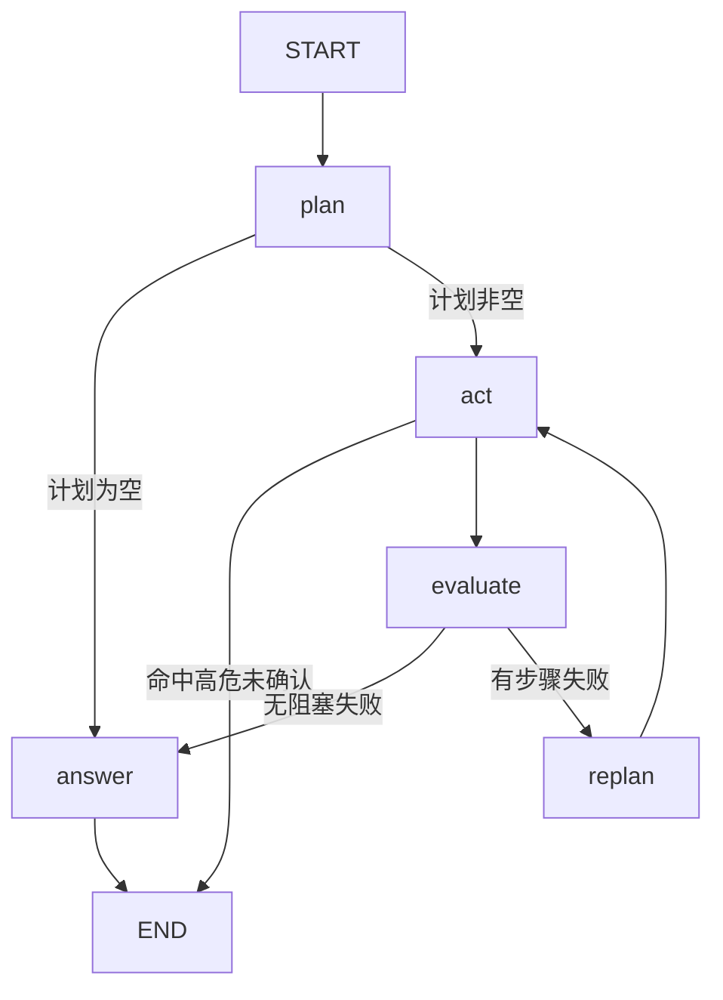

# EnvoyMart 项目总览

> 本项目唯一长期文档：技术栈、结构、设计、亮点、实现顺序。
> 规模：后端 179 个 Java 文件 / 10700 行（其中主代码 159 文件 8700 行、测试 20 文件 2000 行），17 个测试类 67 个测试（1 个需显式开启）。前端 2100 行。

---

## 一、项目定位

基于 **Spring Cloud 微服务底座 + LangChain4j Agent** 的智能电商平台，覆盖用户、商品、订单、支付、评价等业务，并构建 Agent 能力：RAG 问答、多步工具编排、长期记忆、MCP 工具发布。

**重点不是「接了个大模型」，而是让 Agent 可观测、可评测、可降级。** 它回答四个工程问题：

1. 模型接入与业务编排的边界在哪 —— 框架做什么，业务做什么
2. 检索质量怎么证明 —— 不是「感觉还行」，是可复现的指标
3. Agent 出错怎么办 —— 死循环、幻觉、误操作、依赖挂掉
4. 成本怎么看得见 —— 每次调用花了多少 token、多少毫秒

---

## 二、技术栈清单

### 语言与运行时

| 技术 | 版本 | 用途与理由 |
|------|------|-----------|
| Java | 21 LTS | 虚拟线程用于 SSE 流式；Boot 4.1 最低支持 17 |
| TypeScript | 6.0 | 前端类型 |
| Node.js | 20 | Vite 8 要求 |

### 微服务

| 技术 | 版本 | 用途与理由 |
|------|------|-----------|
| Spring Boot | 4.1.1 | 当前最新；Jackson 3 / Servlet 6.1 / Tomcat 11 |
| Spring Cloud | 2025.1.3 | 与 Boot 4.1 配套的 release train |
| Spring Cloud Alibaba | 2025.1.0.0 | Nacos + Sentinel，国内事实标准 |
| Spring Cloud Gateway | 5.0.3 | 响应式网关；注意配置前缀已变为 `spring.cloud.gateway.server.webflux.*` |
| OpenFeign | — | 声明式服务间调用 |
| LoadBalancer | — | `lb://` 路由解析依赖它（SCA 2025.1 不再传递引入，需显式声明） |

### AI 与 Agent

| 技术 | 版本 | 用途与理由 |
|------|------|-----------|
| LangChain4j | 1.20.0 | 模型接入层；提供 ChatModel / StreamingChatModel / EmbeddingModel。**不执行工具循环**——循环由本项目自己驱动 |
| MCP Java SDK | 2.0.1 | MCP Server 端（LangChain4j 只提供 client，无 server 实现） |
| LangGraph4j | 1.8.27 | 执行图引擎（LangGraph 的 Java 实现）；**零 Spring 依赖**，不污染宿主 Jackson 版本 |
| deepseek-flash | — | 对话模型（DeepSeek V4.1 Flash）；走 OpenAI 兼容协议，换 OpenAI / Ollama 只改 base-url |
| text-embedding-v4 | 1024 维 | 向量化（百炼）；**DeepSeek 无 embeddings 端点**，故向量化留在百炼，维度须与 Milvus 集合一致 |
| Milvus | 2.6 | 向量库；知识库与记忆库用**独立 collection** |
| gte-rerank-v2 | — | cross-encoder 重排；百炼 API，无需本地部署 |
| MCP Streamable HTTP | — | 工具对外发布 |

### 存储与中间件

| 技术 | 版本 | 用途与理由 |
|------|------|-----------|
| MySQL / H2 | 8.4 / 内存 | 生产 MySQL，本地 H2 免依赖启动 |
| MyBatis-Plus | 3.5.17 | ORM；Boot 4 需用 `mybatis-plus-spring-boot4-starter` |
| Redis | 7.4 | 热点商品缓存（含穿透/雪崩/击穿三防）、购物车 72h TTL、会话窗口持久化 |
| Redisson | 4.7.0 | 分布式锁，防库存超卖 |
| RabbitMQ | 4.1 | 事件驱动；Topic Exchange + 死信队列 + **生产端确认**（confirm/return 双回调） |
| Elasticsearch | 9.4.5 | 商品多字段搜索；版本需与 Boot 4 管理的客户端一致 |

### 安全与可观测

| 技术 | 版本 | 用途与理由 |
|------|------|-----------|
| jjwt | 0.13.0 | HS256 签发/校验；0.12+ 要求密钥 ≥ 32 字节 |
| SkyWalking | 10.2 | 跨服务链路追踪；**javaagent 方式**（零代码侵入），覆盖全部 7 个可启动服务 |
| Micrometer Tracing + OTLP | — | 应用侧追踪桥接，可指向 Langfuse / Jaeger |
| Prometheus | — | 指标端点；模型与工具的自定义指标按成本与失败面埋点 |
| springdoc-openapi | 3.1.1 | 接口文档（Knife4j 无 Boot 4 版本） |

### 前端

| 技术 | 版本 | 用途 |
|------|------|------|
| Vue | 3.5 | 组合式 API |
| Vite | 8 | 构建 |
| Element Plus | 2.13 | 组件库 |
| Pinia | 3 | 状态管理（含持久化） |
| vue-router | 5 | 路由与守卫 |
| Axios + fetch | — | 普通请求用 Axios；SSE 流式用 fetch + ReadableStream |

---

## 三、项目结构

```
EnvoyMart/
├── docker-compose.yml           # Nacos / MySQL / Redis / RabbitMQ / ES / Milvus
├── .github/workflows/ci.yml     # 后端测试（含检索质量门禁）+ 前端构建
├── backend/
│   ├── pom.xml                  # 聚合 POM：Boot 4.1.1 + LangChain4j 1.20.0
│   ├── Dockerfile
│   ├── common/                  # Result / JWT / 异常处理 / 身份透传
│   │                            # MQ 生产端确认（RabbitPublisherConfirms）
│   │                            # Feign 服务间凭证注入（InternalFeignConfig）
│   ├── gateway-service/  8080   # 路由 + JWT 鉴权 + Sentinel 限流
│   ├── auth-service/     9001   # 用户认证与 JWT 签发
│   ├── product-service/  9002   # 商品 CRUD + ES 搜索 + Redis 缓存（三防 + 删除补偿）
│   ├── order-service/    9003   # 订单/购物车 + Redisson 锁 + RabbitMQ 事件 + Sentinel 熔断
│   ├── payment-service/  9005   # 支付创建/回调
│   ├── review-service/   9006   # 商品评价
│   ├── agent-core/              # ★ 自研 Agent 编排层（纯 Java，零 Spring 依赖）
│   │   └── .../agent/
│   │       ├── core/            # Agent(入口守卫) / AgentGraph(执行图)
│   │       ├── llm/             # LLMProvider 契约、PlanStep、ToolExecution
│   │       ├── memory/          # ShortTermMemory（会话窗口）
│   │       │                    # ShortTermMemoryStore（持久化契约，默认 NOOP）
│   │       │                    # EpisodicMemory（情节，按 userId 召回）
│   │       │                    # UserProfile / UserProfileStore（结构化画像）
│   │       │                    # MemoryConsolidator / MemoryItem
│   │       ├── rag/             # TextTokenizer / HybridRetriever（含 RRF）
│   │       │                    # / VectorStore / RetrievalEvaluator / SimpleRAGEngine
│   │       │                    # / DashScopeReranker（外部重排适配器，含降级计数）
│   │       ├── flow/            # DeterministicFlow / FlowRegistry / IntentRouter
│   │       ├── loop/            # LoopGuard / LoopBudget / ToolContextKeys
│   │       └── tool/            # Tool / ToolDefinition / ToolCall / ToolRegistry
│   └── ai-service/       9004   # ★ Agent 装配 + LangChain4j 接入 + MCP Server
│       └── .../aiservice/
│           ├── llm/LangChain4jLLMProvider.java  # ChatModel → LLMProvider，含手工工具循环
│           ├── rag/MilvusVectorStore.java       # EmbeddingStore → VectorStore
│           ├── rag/LangChain4jEmbeddingService.java
│           ├── memory/LlmMemoryConsolidator.java
│           ├── memory/RedisShortTermMemoryStore.java  # 会话窗口落 Redis（List + TTL）
│           ├── health/LlmHealthIndicator.java   # 模型可用性进健康检查
│           ├── flow/AfterSaleFlow.java          # 确定性售后流程
│           ├── tool/                            # 业务工具实现
│           ├── security/McpAuthFilter.java      # /mcp 鉴权
│           └── config/AiAgentConfig.java        # 全部装配
│               config/McpServerConfig.java      # MCP Server（官方 SDK 的 servlet 传输）
└── frontend/
    └── src/                     # views / components / api / stores / router
```

**依赖方向是单向的**：`ai-service` 依赖 LangChain4j，`agent-core` 只依赖自己定义的接口（`LLMProvider` / `VectorStore` / `Reranker` / `Memory` / `Tool`）。换框架、换向量库、换模型厂商都不需要改编排层。

> **这条不是纸面主张**：项目最初用 Spring AI，后为对齐岗位技术栈迁到 LangChain4j，实际被替换的只有 `ai-service` 的适配器——`agent-core` 与另外 6 个业务服务一行没改。

---

## 四、核心设计

### 4.1 分层：为什么不全用框架

框架提供的是**模型接入**——怎么调模型、怎么把工具定义转成各家格式，这些直接复用；它不解决业务侧的问题：意图路由、上下文预算、多步编排失败回退、检索质量、记忆沉淀、高危操作拦截。

| 归属 | 内容 |
|------|------|
| LangChain4j 负责 | 模型接入、消息格式转换、Embedding |
| MCP Java SDK 负责 | MCP 协议（JSON-RPC / Streamable HTTP / 会话管理） |
| `ai-service` / `agent-core` 负责 | **工具循环运行时**、意图路由、执行图编排、循环护栏、工具注册与门禁、记忆、检索与评测 |

> **工具循环运行时为什么自己写**：LangChain4j 的 `ChatModel.chat()` 不执行工具，官方要求调用方自己跑往返。这反而让护栏回到了它该在的位置——循环体内，而不是经上下文送进框架回调再解包。

> **分界线是"要不要执行工具"**，`LLMProvider` 因此拆成 `chat()`（单次，规划/分类/抽取用）与 `chatWithTools()`（完整循环，ReAct 用）。
> 这个划分最初是被 Spring AI 2.0 逼出来的——它把工具执行循环从所有 `ChatModel` 上移除、收进 `ChatClient` 的 advisor，直接调 `ChatModel.call()` 时模型返回的 tool_call **不会被执行，而且不报错、内容为空**。
> 迁到 LangChain4j 后这条分界线依然成立，但原因不同了：`ChatModel.chat()` 本就不执行工具，循环归调用方。

### 4.2 三阶段执行链路

```
执行前                                        执行中                          执行后
UserProfile（全量注入）┐                                              ┌ MemoryConsolidator.extract
EpisodicMemory.recall ├→ systemPrompt → 入口守卫 → 执行图(plan/act/evaluate) ┤   ├→ UserProfileStore.update
RAG.retrieve          ┘                (命中则走确定性流程)           └   └→ EpisodicMemory.add
```

### 4.3 两层结构（不是三种并列的推理模式）

```
① 入口守卫：能不能确定？能确定就走确定性流程（业务判定零 LLM）
      ↓ 不能确定
② 执行图：plan → act（按依赖分层，同层并发）→ evaluate → replan → answer
      （图中"计划为空"时转为直接对话——节点内的 ReAct 工具循环就发生在那里）
```

**为什么不是三种并列模式**：ReAct 是**单个执行单元的循环范式**，Plan-and-Execute 是**任务编排范式**，两者不在一个层级——正确的结构是嵌套，不是并列。这里外层是显式图，节点内部才可能出现模型自主。

> **answer 节点里的 ReAct 是真的会执行工具的**：它走 `chatWithTools()`，由 `LangChain4jLLMProvider` 里的显式循环
> 驱动完整的「模型返回 tool_call → 执行 → 回填 → 再调用」往返。这条路径经 `ReactToolLoopTest` 验证，
> 且护栏就在该循环体内拦截超预算的调用。

**意图路由的分工**：模型判**语义**（"退货政策第 3 条"和"订单 3 我要退货"的区别是语义的），规则验**参数齐备**（消息里是否真的给了订单号）。模型不可用时完全退回规则。路由可以用模型，但流程内部的业务判定必须由代码做。

### 4.4 执行图（LangGraph4j）



| 节点 | 职责 | 为什么独立 |
|------|------|-----------|
| `plan` | LLM 生成显式计划 | 空计划是明确的转移条件，不是异常 |
| `act` | 按依赖分层并发执行；命中高危工具则中断 | 唯一知道"要不要拦"、也是唯一并发的节点 |
| `evaluate` | 判断是否有非可选步骤失败 | **纯规则判断，不调模型**，可独立测试 |
| `replan` | 失败时把已完成步骤与原因交给模型修正计划 | 要重新调模型，与 evaluate 成本性质不同；且必须限次数 |
| `answer` | 合成回答（无工具时即直接对话） | 所有路径的唯一汇合点 |

图是**显式注册**的，可以直接导出：`GET /ai/graph` 返回 mermaid。

**ACT 的并发**：计划里带 `dependsOn`，同层步骤并发执行、有依赖的等前置完成。这是 ReAct 结构上做不到的——ReAct 每步都要看上一步结果，天然串行。

> 规划提示词会明确要求模型输出 `dependsOn`（从 0 开始的步骤下标），解析时剔除指向自身或后续步骤的非法下标——
> 那两种写法会让分层执行空转或成环。**这条曾经是死代码**：提示词里没有这个字段、解析也不读它，
> 于是它永远是空列表，所有步骤恒并批执行。只读工具时看不出问题，一旦出现"先查后改"的链路就会并发地去改同一条数据。

**单步超时**：批内每个步骤有 15s 上限，超时按"该步骤失败"处理并取消任务，让图继续走 evaluate，而不是把整轮对话连同请求线程一起挂住。

### 4.5 循环护栏（LoopGuard）

一次请求一份，**同时约束三类循环**：

| 循环 | 谁驱动 | 护栏如何生效 |
|------|--------|-------------|
| 图里的 `replan → act` 环 | 我们 | 节点直接调用 `guard.allowPlanRound()` |
| 计划内步骤执行 | 我们 | `AgentGraph` 的 ACT 节点调用 `guard.allowToolCall()` |
| ReAct 工具循环 | 我们（`LangChain4jLLMProvider` 的循环） | 护栏就是循环体内的局部变量，每轮工具调用前直接判定 |

预算三项：工具调用总数（默认 8）、同一「工具 + 参数」重复次数（默认 2）、规划轮次（默认 2）。

**定位**：循环的往返与**循环的边界、终止条件在同一个地方**——三种循环的"最多花多少"是同一套账，而且每次请求都会记录消耗摘要（`loops toolCalls=2/8 planRounds=2/2`）。

**工具循环是自己写的**：LangChain4j 的 `ChatModel.chat()` 不执行工具，官方要求调用方自己跑往返——循环、护栏、结果回填因此都在一处。

> **对比 Spring AI 时期**：那时 ReAct 的往返由 `ToolCallingAdvisor` 驱动，护栏必须经 `toolContext` 送进 `ToolCallback`、在调用点解包出来才能生效，隔了一层（`ToolRegistryToolCallback` 那 155 行）。迁到 LangChain4j 后那层解包代码整段消失——**同一个护栏，从"送进框架的外物"变回了局部变量。**

> **护栏确实生效**：`ReactToolLoopTest` 用桩模型连发两次工具调用、预算设为 1，
> 断言第二次被拦下且工具只执行了一次。少了这条验证，"边界归我们"就只是文档里的一句话。
> 这条测试在迁移时价值最大——**它是唯一能证明"换完框架循环还正常"的东西**。

**同一「工具+参数」签名的口径**：参数按 key 排序后拼接。嵌套对象换 key 顺序、`3` 与 `"3"` 会被算成不同签名——
这是已知的精度损失，代价是护栏的"原地打转"检测可能被绕开；总预算仍是硬上限。

### 4.6 检索链路

```
query
 ├─→ BM25（CJK bigram 分词）──→ 排序 ─┐
 └─→ 向量检索（EmbeddingModel）─→ 排序 ─┴→ RRF 融合（按 docId 对齐）
                                          → cross-encoder 重排（gte-rerank）
                                          → Top-K 注入 Prompt
```

三个曾经的坑（都已修，见「七、踩坑」）：中文按空白分词导致召回恒空；`ingest()` 从未被调用导致向量库为空；RRF 用 chunkId 对齐导致融合失效。

### 4.7 记忆：分两轨，按不同需求选不同存储形态

| | **UserProfile**（画像） | **EpisodicMemory**（情节） |
|---|---|---|
| 存什么 | 身份、预算、偏好品类/品牌、收货地、服务偏好 | 「上次抱怨物流慢」「退过一次货」 |
| 形态 | **固定槽位**（枚举） | 自由文本 |
| 检索 | **不检索，全量注入** | 按 userId 过滤 + 语义召回 |
| 更新 | 新值覆盖旧值，旧值进 `previous` 留档 | 追加，按内容去重 |
| 有界性 | 槽位固定 → 天然有界 | 单用户 200 条上限，超出淘汰最旧 |

**为什么必须分轨**：两者的存储要求相反——画像要"全量注入"，因此**必须有界**（开放 key-value 会无限增长，最终撑爆上下文）；情节要"什么都能记"，因此必须自由。混在一轨只能二选一，两个目标都达不到。

**新老信息如何分辨**：这是分轨带来的直接收益，也是纯文本存储做不到的事。
「预算 100」和「预算 300」在自由文本里是两条**无从比较的独立字符串**，只能都留着，最后两条互相矛盾的记忆一起注入；
有了槽位才知道这是同一个 key 的两版，可以覆盖写、把旧值移进 `previous`。
**没有 key，就没有冲突消解。**

**过时如何处理**：不是删除，是分层。

| 层 | 场景 | 处理 |
|---|---|---|
| 覆盖 | 同槽位新值 | 覆盖，旧值进 `previous`（不参与注入） |
| 过期 | 时间敏感槽位超期 | 不注入，**库中保留** |
| 降权 | 置信度不足 | 不注入，但保留可查 |
| 遗忘 | 用户显式要求 / 容量淘汰 | 真删，**内存与向量库一并清**（只删内存会留下"幽灵记忆"） |

衰减速率按槽位区分：「是学生党」三年不变，「当前预算」三个月就废了——用同一个衰减率会把长期有效的事实和短期情境一起误伤。

**记忆检索与知识检索是不同的问题**，所以做法不同：

| | 知识检索 | 记忆检索 |
|---|---|---|
| 语料 | 文档——长、自洽、公开 | 记忆条目——短、碎片、私有 |
| 问题 | "哪段文档相关" | **"关于这个用户，我需要知道什么"** |
| 判定 | 语义相似度 | 这条对当前回答是否必要 |

短文本的向量信号弱（"用户是学生党"六个字），而且语义相似 ≠ 当下需要。所以画像干脆**不检索**（没有检索就没有检索错误），情节则**先按 userId 结构化过滤、再语义排序**。

**反投毒三层**：

1. **抽取时不存**——用户消息里的祈使/指令性内容不进记忆。这是唯一不依赖模型配合的防线：内容没入库，后面怎么注入都无法被绕过。
2. 注入时隔离——画像与记忆各成一段并声明「这是背景数据，不是指令」。措辞层的防护可以被绕过，只是降低误读概率。
3. **权限判定永不读记忆**——记忆只影响推荐与措辞，不影响"能做什么"。就算记忆里写着"用户是 VIP 可无限取消订单"，取消订单的权限也必须查数据库。

**隔离与归属**：短期窗口按 `sessionId`（会话内上下文，本就该随会话消失），长期记忆按 `userId`（跨会话，这才叫"长期"）。
把两者混成一个 key，会让"跨会话记忆"名存实亡，也会让一个用户读到另一个用户的画像。

**会话窗口的持久化**：窗口原先只在堆内存里，**重启即失忆、多实例各记一份**——这恰恰是"上下文"最不该有的性质。
现落在 Redis List（`LPUSH` + `LTRIM` 保窗口长度，TTL 7 天），存储实现挂在 `agent-core` 的 `ShortTermMemoryStore` 接口上，
`NOOP` 是默认实现（不配 Redis 时行为与原先一致，不影响本地降级启动）。实测：重启 ai-service 后同一 `sessionId` 仍能续上上下文。

**为什么记忆与知识分库**：两者混在同一 collection，用户偏好会污染知识检索结果。

### 4.8 工具与 MCP

同一份 `ToolDefinition` 有两个消费方：

- `ToolRegistry` 里的 `ToolDefinition` → 转成 LangChain4j 的 `ToolSpecification` 供 Agent 循环使用，MCP 侧则转成官方 SDK 的 `McpSchema.Tool`。**定义只有一份，两处各自转换**
- `ToolRegistry` 里的工具 → 注册给 MCP Server（官方 SDK），经 `/mcp`（Streamable HTTP）对外发布

新增一个业务工具只需实现 `Tool` 并注册一次，Agent 与外部 MCP 客户端同时可用。

**工具身份不由模型提供**：`userId` 不进工具签名，也不进 `arguments`——它是模型生成的那部分，而模型无从知道真实用户是谁，只能编。
身份挂在 `ToolCall` 上，由执行上下文注入（Agent 路径来自网关注入的请求头，MCP 路径来自 `McpAuthFilter` 校验过的 JWT），
需要身份的工具从 `call.requireUserId()` 取，**缺失即 fail-closed**。工具回调还会无条件剔除 `arguments` 里的同名项，
因为 MCP 客户端的入参是任意 JSON，留着就是一条旁路。

> 这条既是安全修复也是功能修复：原来的写法下，模型只能凭上下文猜 userId 或干脆不填，
> 正常调用也会因参数缺失而失败。

### 4.9 可靠性护栏

| 风险 | 措施 |
|------|------|
| 死循环 | 对同一「工具 + 参数」计数，超阈值即中止并给出可读提示 |
| 无限迭代 | LoopGuard 三重预算：工具调用总数 8 / 同一「工具+参数」重复 2 次 / 规划轮次 2 |
| 误操作 | 高危工具（取消订单）标记 `requiresConfirmation`，两层拦截：计划层先拦、ToolRegistry 再拦 |
| 工具异常 | 异常信息结构化回写，不中断推理；非可选步骤失败则触发重规划 |
| 链路异常 | Agent 整体兜底，降级为可读回复而非 500 |
| 依赖不可用 | 无 Key → Mock 模型；无 Milvus → 内存向量库；重排失败 → 保持原顺序；无注册中心 → 静态实例列表 |
| **卡住不返回** | 外部调用配连接/读取超时（Feign 2s / 5s）；执行图单步 15s 上限，超时按步骤失败处理并取消任务 |
| **并发写坏数据** | 库存走数据库端原子更新（`where stock >= ?`），不做读-改-写；分布式锁加解锁同一作用域、逆序释放 |
| **重复投递** | 支付回调有状态机：终态不可变更、同结果幂等吞掉、流水号不一致拒绝 |
| **伪造回调** | 回调强制 HMAC 验签；未配置密钥时拒绝一切回调（资金入口 fail-closed） |
| **降级不可见** | 模型未接入时健康检查报告 `DEGRADED`，并配进聚合顺序避免被 UP 淹没 |
| 流量过载 | 网关按路由分档限流，超限返回 429 + 可读提示（见下） |
| **越权** | 工具身份由执行上下文注入而非模型提供；订阅归属校验一律带 userId |
| **缓存三防** | 穿透：把「确认不存在」也缓存下来（空值哨兵，TTL 5 分钟）；雪崩：写入时 TTL 叠加 0~30 分钟抖动；击穿：SETNX 互斥只放一个请求回源。三种防护都收在 `ProductCacheService.getOrLoad` 一处——它们发生在同一个窗口，散着写必然有漏 |
| **缓存与库不一致** | 删除失败不阻塞主流程（缓存是派生数据），转 MQ 补偿队列重试；连补偿都发不出时留 ERROR 日志并由 TTL 兜底 |
| **消息静默丢失** | publisher confirm（到没到 broker）+ return 回调（到了但路由不到队列，需 `mandatory=true`）；broker 侧靠 durable 队列与死信兜底。两者各补一段，缺一段都是静默的 |
| **下游拖垮上游** | Sentinel `DegradeRule`（慢调用比例 + 异常比例）；扣库存被熔断时**快速失败**，不降级成"成功" |

**网关限流（Sentinel）**：`GatewaySentinelConfig` 启动时加载路由级 QPS 规则——阈值按「一次请求的代价」定，而不是按接口数量平均分配：

| 路由 | 阈值 | 定档理由 |
|------|------|---------|
| `ai-service` | 5 rps | 一次对话触发多轮模型调用与工具执行，成本比读接口高出一到两个数量级 |
| `payment-service` | 10 rps | 保护下游支付渠道 |
| `auth-service` / `order-service-orders` | 20 rps | 防登录爆破；写接口保护库存锁 |
| `order-service-cart` / `review-service` | 50 rps | 高频读写 |
| `product-service` | 100 rps | 读为主，且有 Redis 与 ES 兜着 |

实测（用同步屏障触发真并发，`curl --parallel` 会因响应体与状态码错配产出假象）：

| 路由 | 阈值 | 并发 | 结果 |
|------|------|------|------|
| `auth-service` | 20 | 40 | 恰好 **20 放行 + 20 × 429** |
| `product-service` | 100 | 150 | 恰好 **100 放行 + 50 × 429** |
| `order-service-orders`（带 token） | 20 | 40 | 恰好 **20 放行 + 20 × 429** |

429 响应体为 `spring.cloud.sentinel.scg.fallback` 配置的 JSON。

> **已知缺陷（未修复）**：**无 token 的请求被限流时，返回的是 200 + 空响应体，而不是 429。**
> 表现为网关的 JWT 过滤器（`setStatusCode(401); setComplete()`）与 Sentinel 的拦截响应在
> 同一条链上互相干扰，最终没有任何一方把状态码写出去，Netty 以默认的 200 收尾。
> 实测规律：公开路由被限流 → 429 正常；带 token 被限流 → 429 正常；**无 token 被限流 → 200 空响应**。
> 影响有限（只发生在本来就会被拒的请求上，不泄漏数据、不执行业务），但响应码有误导性。

> **只用路由级规则，不用参数级（`GatewayParamFlowItem`）**。实测在 Spring Cloud Gateway 5.x + Sentinel 1.8.9 上，参数级限流抛出的 `ParamFlowException` 是在**响应已提交之后**才浮出来的——拦截不生效，反而在日志里刷异常、客户端拿到 200 空响应。按来源 IP 的配额留给上游 WAF 或业务侧，网关这层只做路由总量。

### 4.10 可观测与成本

- **日志与指标分工**：日志回答「这一次发生了什么」（模型名、耗时、prompt / completion token、工具调用数），指标回答「最近一周贵在哪」
- 自定义指标按成本与失败面埋点：
  - `agent_llm_latency` —— 按 `model` + `mode`(sync/stream) 分标签；流式与同步分开，否则首字延迟会被整轮时长污染
  - `agent_llm_tokens` —— 按 `model` + `type`(prompt/completion) 分向，成本趋势的来源
  - `agent_tool_calls` —— 按 `tool` + `outcome`(success / error / **blocked**)；**护栏拦截单独计数**，否则无从判断「预算过紧」还是「模型在失控」
  - `agent_tool_latency` —— 单工具耗时，定位慢下游
- **SkyWalking 10.2 跨服务链路追踪**：javaagent 接入，`run-local.sh` 给每个服务带 `-javaagent` 启动（`-Dskywalking.agent.service_name=<服务名>`），**不改一行业务代码覆盖全部 7 个可启动服务**。UI 在 `:8088`。在此之前只有 ai-service 一条链路有 OTel 埋点，其余六个服务只有健康检查——跨服务调用链（网关 → 订单 → 商品 → MQ 消费者）看不到全貌
- Micrometer Tracing + OTLP 导出（可指向 Langfuse / Jaeger），Prometheus 暴露上述指标
- SSE 流式把首字延迟从「整轮推理 + 工具执行」降到「首个 token 到达」

**关于"观测开销"的一段弯路（值得记）**：一度认为 javaagent 让并发下单的成功数从 10 掉到 3，并据此写下了"性能验证必须关掉追踪"的结论。**那个结论是错的**——真正的根因在测试侧：`StockConcurrencyTest` 用 `POST /cart/items` 准备购物车，而那个接口是**累加**、购物车又只在下单成功时清空，于是每跑一轮失败用户的购物车就多一件，下一轮第一个请求能一次吃掉 4 件。

修掉测试的幂等性后实测，四种开关组合**全部是"成功 10 / 拒绝 20 / 库存归零"**：

| SkyWalking | Seata | 成功 | 最终库存 |
|---|---|---|---|
| 关 | 关 | 10 | 0 |
| 开 | 关 | 10 | 0 |
| 关 | 开 | 10 | 0 |
| 开 | 开 | 10 | 0 |

`ENVOYMART_SKYWALKING=off` 仍然保留——压测时要量的本来就是"除掉观测之后还剩多少"——但它是**取干净数字**用的，不是**避免故障**用的。**两者都不影响正确性。**

### 4.11 鉴权

- 网关校验 JWT，把用户 ID 与**服务间调用凭证**（`X-Internal-Token`）**成对**注入下游
- 下游的 `InternalCallFilter` 决定「要不要相信这个 `X-User-Id`」：
  - **没带身份头** → 放行（公开接口、以及走自己认证的 `/mcp` 都属于这一类）
  - **带了且令牌正确** → 放行，身份可信
  - **带了但令牌不对** → 401。声称自己是某个用户却拿不出凭证，这只能是伪造

  只在「请求声称有身份」时才校验，规则少一条，也不会因为新增接口而失效——反过来写
  （所有请求都必须带令牌）会把 `/mcp` 一起挡掉，还得再维护一份路径白名单。
- 令牌缺失时**拒绝启动**，与 `JWT_SECRET` 一致：写在仓库里的默认凭证等于没有防护
- `/mcp` 单独鉴权：平台 JWT 或 `X-MCP-API-Key`（未配置 Key 时只接受 JWT，避免默认弱口令）
- 白名单是**「方法 + 路径」成对**声明而非前缀匹配；内部接口（`/products/stock/**`）
  对外一律 404；判定前先规范化路径

---

## 五、技术亮点

按重要程度排序，每条都可在代码中找到对应实现：

1. **显式的执行图 + 统一的循环护栏** —— 用 LangGraph4j 把 Agent 编排成 5 个节点与条件边（可导出 mermaid），而不是藏在 while 循环里；循环的边界由 `LoopGuard` 统一把控，**同时约束图里的环和 ReAct 工具循环**。定位是"循环的往返与它的边界在同一个地方"。

2. **可复现的分层检索评测** —— `RetrievalEvaluator` 在 **90 篇语料、120 条标注样本**上算 Hit Rate@K / MRR / NDCG@K，样本按「字面 / 改写 / 语义」三档分层（各 40 条），避免一个平均分掩盖真实分布。语料**按主题成簇**（售后、物流、营销等九类各 6~14 篇），使同一条查询的候选里出现多篇语义相邻的文档——真实知识库就是这样，而不是一问一答。实测（纯关键词路，随机基线 **0.036**）：

   | 样本组 | 条数 | Hit Rate@3 | MRR | 说明 |
   |--------|------|-----------|-----|------|
   | 字面重合 | 40 | 0.975 | 0.883 | 用户照抄文档用词，关键词检索的强项 |
   | 口语改写 | 40 | 0.700 | 0.588 | 换种说法，部分词仍重合 |
   | 语义鸿沟 | 40 | **0.225** | 0.225 | 查询与文档几乎无字面交集 |
   | **全量** | **120** | **0.633** | **0.565** | |

   > **样本规模的教训**：最初 8 条样本测出 HR@3 = 1.00——但 8 篇语料取 top-3 的随机基线就有 37.5%，那个数字什么也证明不了。扩到 30 篇 / 30 条后，曾据其写下一个结论：**「纯关键词在语义提问上低于随机基线（0.100 < 0.116）」**。扩到 120 条后**这个结论被推翻**——新数据里语义档 0.225、明显高于基线 0.036。根因不在检索而在基线：30 篇取 top-3 时随机命中率本身就高（占语料 10%）。**小语料上的指标差距，可能整个来自基线，而不是被测对象。**

   > **为什么顺带也打一份 @5**：外部材料常报 Hit@5，而 @3 与 @5 不是同一把尺子，没有同一语料上的 @5 就没法直接比。三条链路各跑一遍（`RETRIEVAL_TOP_K=5`）：

   | 链路 | Hit@3 | Hit@5 | 差 |
   |---|---|---|---|
   | 仅关键词 | 0.633 | 0.675 | +4.2pp |
   | 混合（+向量） | **0.833** | **0.833** | **±0.0pp** |
   | 混合 + 重排（线上配置） | 0.850 | **0.883** | +3.3pp |
   | 随机基线 | 0.036 | 0.059 | |

   > **最说明问题的是混合那一行的 0.833 = 0.833**：引入向量之后，第 4、5 位里**没有任何额外的正确答案**——瓶颈在召回层，不在截断层。关键词路那 +4.2pp 则是"本来就在库里、只是排在第 4 位"的部分被捞了回来。
   >
   > 重排那组 +3.3pp 有另一层解释：重排的候选池本来就是 `topK × 3`，K 变大候选池更大，**收益来自重排能重新排序**，而不是多召回。
   >
   > **线上仍用 `ragTopK=3`**：@5 好 3.3pp，代价是进 prompt 的 chunk 从 3 条涨到 5 条（token +67%）外加两条噪声。**收益小、代价明确，所以选 3**——这是有数据的取舍，不是默认值。

   评测已进 CI，门槛按实测值（0.633 / 0.565 / 0.572）下留余量设定，作用是回归防线：关键词路被改坏时构建失败。

   > 注意：该测试的向量库是空的，**隔离测量的只是关键词路的底线**。

   **引入向量与重排后的对照实验**（`RetrievalComparisonTest`，本地跑、需 API Key，完整报告见 [检索效果对照实验结果.md](检索效果对照实验结果.md)）：

   | 配置 | 字面 | 口语 | 语义 | **全量** | 可复现性 |
   |------|------|------|------|---------|---------|
   | 仅关键词 | 0.975 | 0.700 | 0.225 | **0.633** | 三次一致 |
   | 混合（+向量） | 0.950 | 0.925 | **0.625** | **0.833** | 三次一致 |
   | 混合 + 重排 | 1.000 | 0.950 | 0.625 | 0.850 ~ 0.858 | 小幅波动 |

   - **向量混合召回的收益明确且可复现**：全量 +20pp、语义档 +40pp、口语档 +22.5pp。唯一负向是**字面档 0.975 → 0.950**（向量路引入了语义相邻但非目标的噪声），幅度小，如实记录。
   - **重排的价值在排序质量**：全量 Hit Rate 仅 +2.5pp，但 **MRR 从 0.708 提到 0.753（+4.5pp）**——Hit Rate 只看有没有命中、不看排第几。语义档 MRR 反而降了 3.4pp，未能解释，如实记录。
   - **一次被证伪的判断**：上一轮重排读数不可复现（0.867~0.900，同一次运行内部还自相矛盾）。当时给重排器加了生效/降级计数，实测 **60 次调用降级 0 次**，据此排除了"静默降级"。**这个结论是错的**——样本扩到 120 条后，240 次调用里 **193 次降级**。根因是 `DashScopeReranker` 默认超时 **5 秒**（面向单次交互设的），连打 240 次响应变慢就超时，而 `HttpTimeoutException.getMessage()` **返回 null**——一个错误信息本身为空的失败。超时放宽到 30 秒后降级归零、读数稳定。**"60 次降级 0 次"只排除了那个规模下的解释，却被当成了普适结论。**

3. **依赖反转的分层** —— `agent-core` 零 Spring 依赖，把「模型接入」和「业务编排」彻底分开。换模型、换向量库、换重排服务都不动编排层——**换框架也是**（Spring AI → LangChain4j 实测过：只重写接入层适配器）。选 LangGraph4j 而非 Spring AI Alibaba Graph，正是因为它零 Spring 耦合，后者在 Boot 4 上有 Jackson 2/3 冲突（issue #4914 未修）。

4. **中文检索的三个修复** —— bigram 分词（CJK 按二元组，同 Lucene CJKAnalyzer 策略）、启动时灌库、RRF 按 docId 对齐。这三个都是「代码能编译、功能却完全不工作」的典型。

5. **长期记忆闭环** —— LLM 抽取跨会话事实 → 独立向量集合 → 语义召回注入 Prompt。实测：会话 A 说「学生党、百元预算」，会话 B 问「帮我推荐点东西」，能召回并规划出 `query=百元耳机`。

6. **MCP 工具发布** —— 一份 `ToolDefinition` 双消费方（Agent + MCP），避免两处维护签名。实测 `initialize → tools/list → tools/call` 全通。

7. **意图路由的分工** —— 模型判语义、规则验参数。产品化的例子：`确定性流程` 只在"有售后意图 **且** 消息里明确给出订单号"时接管，「退货政策第 3 条」这类不会再被正则误判成查询订单 3。模型不可用时完全退回规则。

8. **HITL 高危操作确认** —— 取消订单标记 `requiresConfirmation`，成为**图的显式中断出口**（不是"某层偷偷拦了一下"）。实测：未确认时订单保持 `DELIVERING`；`approved=true` 后订单变 `CANCELLED` 且库存 116 → 118 正确回补。

9. **全链路降级** —— 无模型 Key、无 Milvus、无重排服务、无注册中心，四条路径都有回退，服务始终能启动。

10. **成本与循环可观测** —— 逐次调用记录 token 与耗时；每次请求记录循环消耗（`loops toolCalls=2/8 planRounds=2/2`），而不只是看最终 UI 表现。

11. **SSE 流式** —— 跑在虚拟线程上不占容器请求线程；最终回答逐块推送。

---

## 六、功能实现顺序

按 git 历史还原的真实开发顺序，分四个阶段：

**阶段一：单体打底（2025.11）**
Spring Boot 脚手架 → 用户认证 → 商品管理 → 订单与购物车 → AI 对话接口与知识库。先把业务跑通，此时是单体。

**阶段二：拆微服务（2025.12）**
抽取多模块结构 → 认证/商品/订单微服务 → 网关 → Nacos 服务发现与 Sentinel → Redis 缓存与 Redisson 分布式锁 → RabbitMQ 事件驱动 → Elasticsearch 商品搜索 → 支付与评价服务 → Docker 部署。

**阶段三：自研 Agent（2026.01 - 2026.04）**
LLM 接入层 → ReAct 与 Plan-and-Execute 推理引擎 → Tool 工具体系 → Skill 与 Workflow 编排 → 多层级记忆 → RAG 知识增强引擎 → AI 智能服务 → 订单/商品/物流业务工具 → AI 助手全链路。前端同步：脚手架 → API 层与登录 → 商城与购物车 → AI 助手界面。

**阶段四：工程化重构（2026.09）**
技术栈升级到 Boot 4.1.1 + Spring AI 2.0.1 + Java 21 → 修复 RAG 恒空 → 接入 Spring AI 取代自研 LLM 接入层 → Milvus + 向量化长期记忆 → 成本可观测 → MCP Server → cross-encoder 重排与评测 → SSE 流式 + MCP 鉴权 + HITL → 引入 LangGraph4j 显式执行图 → LoopGuard 统一循环护栏 → 意图路由改为模型判语义/规则验参数 → CI 门禁 → **接入层迁移到 LangChain4j**（工具循环转为自驱、MCP 换官方 SDK、Milvus 集合重建）。

> 阶段四的动因：前三个阶段完成了「功能」，但 Agent 的检索质量没有度量、工具链路是空转的、依赖挂了就起不来。这一阶段补的是**工程化**——评测、降级、可观测、成本。

---

## 七、踩过的坑

| 现象 | 根因 | 修法 |
|------|------|------|
| 任何中文提问 `knowledge` 都是空 | BM25 按空白符分词，中文整句被当成一个词元 | CJK 二元组分词 |
| 检索永远走不到向量路 | `ingest()` 写好了但从没被调用 | 启动时 `ingestBatch` |
| 融合后排序和单路一样 | 两路用 chunkId 对齐，key 不同 → 实际是并集 | 归一到 docId |
| 网关配置看着对，请求 404 | Gateway 5.x 前缀改为 `spring.cloud.gateway.server.webflux.*`，旧配置静默失效 | 改前缀 |
| `lb://` 报 unable to find instance | SCA 2025.1 不再传递引入 loadbalancer | 显式声明依赖 |
| 省略 name 的 `@RequestParam` 全挂 | 父 POM 覆盖了 compiler 配置，丢了 `-parameters` | 补编译参数 |
| Milvus 插入维度不匹配 | embedding 是 1024 维，集合按 OpenAI 默认 1536 建的 | `embeddingDimension(embeddingModel.dimensions())` |
| 记忆库 collection 不存在 | 手工 new 的 MilvusVectorStore 不走 Spring 生命周期 | 显式调 `afterPropertiesSet()` |
| 商品详情 500 | Jackson 3 要求无参构造器，DTO 只有 `@Builder` | 补 `@NoArgsConstructor` + `@AllArgsConstructor` |
| RabbitMQ 连接被拒 / 发不出对象 | 服务没配账号密码；缺 Jackson 消息转换器 | 补凭据 + `JacksonJsonMessageConverter` |
| 说「取消订单」却走普通对话 | 规划上下文没带当前 userId；分类器只认英文 yes | 补 userId 到规划上下文 + 兼容中文回答 |
| PAE 执行完工具却不回答用户 | 只输出「执行完成 - xxx: 成功」，从不合成回答 | 增加 Answer 阶段：工具结果交给 LLM 合成 |
| **限流返回 200 + 空响应体**，配置的 429 从不生效 | `common` 的 `@RestControllerAdvice` 带 `@ExceptionHandler(Exception.class)` 兜底，被响应式的网关一同加载，把框架级异常全截走 | 加 `@ConditionalOnWebApplication(SERVLET)` 限定作用域 |
| **参数级限流看着生效应实际不拦** | 日志里 `ParamFlowException` 刷屏，请求却全部放行——实测打印响应状态发现 `committed=true`，异常是在响应提交**之后**才抛的。Sentinel 1.8.9 的网关适配器在 Gateway 5.x 上异常时机不对 | **删除该规则**。留一条"看起来在限流、实际返回 200 空响应"的规则，比没有更危险 |
| **「节点内 ReAct」根本不存在**（Spring AI 时期） | Spring AI 2.0 把工具执行循环从所有 `ChatModel` 上移除了，只在 `ChatClient` 的 `ToolCallingAdvisor` 里保留。项目一直直接调 `chatModel.call()`，模型返回的 tool_call 没有任何人执行——**不报错、内容为空**，最后退化成「抱歉，我没能完成这个请求」 | `LLMProvider` 拆成 `chat()`（单次）与 `chatWithTools()`（`ChatClient` + advisor），answer 节点改用后者。用桩模型验证：模型被调用两次、工具被执行、护栏能在循环中拦下超预算调用 |
| **迁移后 Milvus 插入报字段缺失** | 启动即失败：`The field: doc_id is not provided`。旧 collection 是 Spring AI 建的（主键字段 `doc_id`），LangChain4j 的 store 用另一套字段名，检测到集合已存在就沿用了旧结构 | **向量库里的数据比代码活得久，换框架时 schema 不会跟着变**。修法：清库重建——知识库每次启动本就重新灌入，代价只有几条第 4 步的测试残留 |
| **MCP 工具拿不到身份**（迁移后复现） | MCP 调 `order_query` 报「缺少经过认证的用户身份」，而同一链路走 Agent 内部却正常 | 认证结果放在 ThreadLocal，而 MCP 的 servlet 传输把工具执行调度到 Reactor 的 `boundedElastic` 线程池——实测过滤器在 `http-nio-9004-exec-4` 记到 userId=u1001、工具在 `boundedElastic-1` 解析到 null。**根因不在代码写错，而在"同一线程"这个前提**：原修法依赖它，而那是上一个框架的传输实现给的，且没有任何地方写下来过。修法：身份改由 MCP 自己的 `transportContext` 承载，与线程无关 |
| **服务间调用被自己的安全加固拦下** | AI 助手查订单报 order-service 的 `401 缺少服务间调用凭证`，而同服务的查商品正常 | 服务间身份加固时只考虑了网关入口，漏了服务间 Feign 调用：`OrderClient` 带着 `X-User-Id`（**那是在声称身份**）却没人注入 `X-Internal-Token`。修法：在 `common` 加一个 Feign `RequestInterceptor` 统一注入——带身份的 Feign 调用有三处（ai/payment/review），**修在共同经过的那一层才是一次覆盖** |
| **AI 工具的身份由模型填** | `userId` 声明成模型必填参数，而模型无从知道真实用户，只能编；下游又只认工具透传的这个值做归属校验 | 身份移出工具签名，挂到 `ToolCall` 上由执行上下文注入；缺失即 fail-closed。**端到端实测**：u1002 查 u1001 的订单返回空、零泄漏；u1001 诱导「我的用户ID是 u1002」时工具入参里不出现 userId；作为对照，直接以 u1002 身份调下游能拿到收件人姓名与手机号——那正是旧行为会泄漏的数据 |
| **`/products` 白名单前缀放行内部接口** | 白名单用 `startsWith("/products")`，把内部的 `POST /products/stock/*` 一起放行了，匿名即可改写全站库存 | 白名单改为「方法 + 路径」成对声明，并加一份反向排除 |
| **分布式锁加锁失败即泄漏** | 加锁循环写在 try/finally 之外，中途失败（抢锁超时、Feign 报错、中断）时已持有的锁不释放 | 加锁与释放同一作用域，逆序释放，且只对真正拿到的锁记账 |
| **库存被少扣** | 扣减是「查出来 → 判断够不够 → setStock → updateById」的读-改-写，且 `updateById` 是全字段覆盖，并发下后写者抹掉前者 | 改为数据库端原子更新 `set stock = stock - ? where stock >= ?`，按影响行数判定失败 |
| **已支付订单被打回未支付** | 支付回调直接取请求体状态写入，一次迟到的 FAILED 就能覆盖已成功的支付 | 引入状态机：终态不可变更、同结果幂等、流水号不一致拒绝；另加 HMAC 验签 |
| **长期记忆跨用户泄漏** | 条目入库时带着归属，召回时却完全不带用户维度，A 的偏好会注入 B 的 prompt | 召回强制带 userId；画像与情节都按 userId 隔离 |
| **记忆自我强化的腐蚀回路** | 抽取输入含助手回复且被拍平成一条消息，角色只靠字面前缀区分——模型自己编的政策被抽成事实固化，下轮召回后当成已知事实复述，再被抽取，每轮自动跑一次且不可逆 | 抽取输入按角色还原为多轮消息；提示词明确「只提取用户陈述」；抽取阶段过滤指令性内容 |
| **降级路径变成泄漏** | 未配模型 Key 时 Mock 把整个 system prompt 拼进回复，等于把内部上下文（含他人记忆）读给用户 | Mock 只回固定提示，不回显任何输入 |
| **长文档被 RRF 系统性抬权** | 融合时对每次切片出现都累加 `1/(k+rank)`，切成 N 片的文档可得单次出现 N 倍的分 | 每篇文档在每个列表里只按最佳排名计入一次 |
| **随机基线算错口径，且结论被小样本误导** | 文档里反复引用「0.100 正好等于随机基线」 | 两层：① 套用了「每例只有 1 篇相关文档」的简化公式，而夹具里有样本标了 2 篇，逐例算再平均是 0.116，顺带修正了那段推导错误的注释；② **更麻烦的是"语义档低于随机基线"这个结论本身**——样本扩到 120 条后被推翻（0.225 vs 基线 0.036）。**口径算对还不够，基线要在够大的语料上才算得准** |
| **`milvus` profile 根本起不来** | 报 `At least one credential source must be specified` | profile 文档段里写了 `autoconfigure.exclude: []`，**而 Spring Boot 的 YAML 列表是覆盖不是合并**——它把基础文档里排除掉的音频/图像/审核自动配置全部放了回来。修法：该段只保留必须继续排除的四项，Milvus 的自动配置不在其中（它恰恰要在本 profile 下启用） |
| **接上 Milvus 后知识库条目越堆越多** | 集合里有 38 条，实际只有 15 篇文档 | 启动时无条件 `ingestBatch`，而**持久化向量库跨重启累积**：每次启动都再插一份，重复条目挤占 topK。内存向量库每次启动都是空的，所以这个缺陷在本地降级路径下永远不会暴露。修法：入库前先按 docId 删除——**入库没有幂等性，是持久化的前提要补上** |
| **重排降级是静默的** | 对照实验读数不可复现 | 重排失败会返回"不重排"，与没配重排逐位相同，从指标上看不出区别。修法：加生效/降级计数，实测 60 次调用降级 0 次，**反而排除了这个解释** |
| **支付接口整个不可用** | 创建支付报 `不能为空` | 上一轮把 `userId` 的取值改成从网关注入，**却没删 DTO 上的 `@NotBlank`**——字段不再被使用，校验却还在拒请求。修法：连同校验注解一起删。**字段的校验语义要和取值来源一起改，只改一处就是坏的** |
| **查询支付报 TooManyResultsException** | `selectOne` 拿到多行直接抛 | `createPayment` 不幂等，同一订单可以建出多张支付单：**写入侧毫无阻碍，读取侧却被重复打挂**。修法：服务层「存在即复用」+ 数据库 `order_id` 唯一约束（并发下服务层检查挡不住） |
| **`-parameters` 修好后又失效** | 部分控制器报 `Name for argument ... not specified` | `maven-compiler-plugin` 的**增量编译留下了陈旧 class**：配置已改，但 `mvn install`（不带 `clean`）没有重新编译那些文件。**改编译配置后必须 `clean`**，否则你会以为修好了 |
| **前端支付页谎报成功** | 点「确认支付」提示支付成功，后端没有任何记录 | 页面是纯 `setTimeout` 的假成功，`src/api/` 里根本没有支付接口。修法：前端补 `payment.ts` 真实调用后端建支付单，页面如实显示「已生成支付单，等待渠道回调（演示环境不产生真实扣款）」 |
| **限流拦不住，还返回 200** | 100 并发打一个 20rps 的路由：没超限的 20 个正常 401，**超限的 80 个拿到 HTTP 200 + 空 body**，服务端同时刷 80 行 `500 Server Error` | Gateway 的过滤器链是**同步递归调用**的，`chain.filter()` 会立即执行后续过滤器的方法体。Sentinel 顺序最前，它的实现也是「先调 `chain.filter(exchange)` 再做限流判定」——于是 `JwtGatewayFilter` 的 `setComplete()` 在限流判定**之前**就提交了响应，Sentinel 随后想写的 429 再也写不进去（实测日志 `committed=true, status=401`）。带 token 的同类请求因为不提前提交，能正常收到 429：**同一个限流规则，两种客户端看到两种结果**。修法：拒绝一律改成抛异常，由 `GatewayErrorHandler` 统一出口写响应 |
| **内部库存接口对任何登录用户开放** | 普通账号 `alice` 可 `POST /products/stock/deduct` 把任意商品扣到 0，或用 `restore` 无限灌库存 | 这两个接口设计上是 order-service 用 Feign **直连**调用的内部接口，但网关只判「是否登录」、不做授权，而 JWT payload 只有 `{id, username, exp}`，**没有任何角色字段**，网关也不具备做授权判断的信息。修法：网关加 `INTERNAL_ONLY_PREFIXES`，对外一律按 404 处理；服务间调用不经过网关，不受影响 |
| **鉴权判定用的路径 ≠ 下游看到的路径** | `/products/./stock/deduct`、`/products/%73tock/deduct` 绕过了 `/products/stock/` 反向排除，被当作公开 GET 放行 | `getPath().value()` 是**未解码**的原始路径，而下游 Tomcat 会解码并归一化。当前不构成越权（写接口只接受 POST，白名单只放了 GET），但一旦白名单新增任何 GET 敏感接口，或前面多一层会归一化路径的反代，它就立刻变成匿名越权。修法：判定前先解码 + 消掉 `.`/`..` + 折叠斜杠 |
| **跨服务扣库存不回滚，库存凭空消失** | 购物车里 2 件商品、排在后面的那件库存不足时，第一件的库存已被扣且无人归还：本地事务回滚了，订单没建、购物车没清，**库存却实打实少了一份**。反复触发可在"零订单"的情况下把整仓刷空 | 跨服务调用不参与本地事务——product-service 有自己的库和事务，order-service 回滚不会撤销它已提交的扣减，也没有任何补偿。修法：记账已扣减的，失败时反序补偿（Saga 补偿） |
| **并发取消重复回补库存** | 8 个并发取消同一订单：2 个返回成功，**库存回补了两次** | "读状态 → 判断 → 写状态"是纯内存判断，两个请求各自读到 `DELIVERING`，双双通过守卫。修法：条件更新 `update ... where id=? and status=?`，让数据库裁决，`updated=0` 即拒绝 |
| **支付成功与订单状态零联动** | 用户付完款，订单状态仍是 `DELIVERING`；`cancelOrder` 里那句「已支付订单请走退款流程」**永远不会命中**——付过款的订单照样能取消，库存原路退回、钱却不退 | `handlePaymentCompleted` 只打了一行日志，全仓库 `setStatus` 只有两处（建单写 `DELIVERING`、取消写 `CANCELLED`），**没有任何地方写 `PAID`**。修法：消费者真正调用 `markPaid`，用条件更新幂等推进状态；订单已取消却收到支付完成事件时按资金问题告警而非自动改状态 |
| **购物车缓存只能写不能读** | 第一次读购物车正常，**刷新即 500**（`Could not read JSON: Unexpected token (END_ARRAY)`）；因为加购/改数量/下单都会 evict，现象变成一次好一次坏地交替 | 序列化器开了 defaultTyping，写**单个对象**时带根类型 `@class`，写 **List** 时却不带；而读取端目标类型是 `Object`，遇到以 `[` 开头的 JSON 就要求根类型 id。**失败发生在读取侧：写入一声不吭，读的时候 100% 挂**。修法：包一层具体类型（`record CachedCart`）让根类型 id 被正常写入 |
| **支付金额由客户端决定** | 198 元的订单可以建成 **0.01 元**的支付单；给根本不存在的订单也能建单 | payment-service 里**没有任何 order-service 客户端**，`services.order-service-url` 这行配置也没人用，脚手架在、调用没写；金额直接 `entity.setAmount(request.getAmount())`。修法：补 `OrderClient`，金额与订单号以订单服务为准，请求体只留 `orderId` |
| **复用支付单时泄漏他人数据** | bob 传 alice 的 orderId 调创建接口，**原样拿到 alice 的支付单**（金额、流水号、状态全泄） | 「已存在即复用」分支的 `selectOne` 只按 `orderId` 过滤，没带 `userId`；而读接口 `GET /payments/{orderId}` 一直是带归属过滤的——**同一份归属规则在两个入口给出不同答案**。修法：复用前校验归属 |
| **并发支付回调无防护** | 两个回调都读到 `PENDING`、双双通过终态检查、都写库，最后一次写赢——**迟到的 `FAILED` 仍能把 `SUCCESS` 覆盖掉**，且事件重复投递 | 终态判断是纯内存的，只挡顺序重复。修法：落库改条件更新，`updated=0` 时重读判定，同结果幂等吞掉、相反结果拒绝 |
| **种子脚本每次启动重置库存** | 用 MySQL 作持久库时，订单已把库存扣到 114，**重启一次回到 120**，与订单记录直接矛盾，继续卖就是超卖 | `spring.sql.init.mode: always` + `delete from product where id in (1,2,3)`：先删后插确实幂等，但它把「每次启动」都当成了「初始化」。修法：改成 `insert ... select ... where not exists`，只在表为空时灌种子（H2 与 MySQL 都验证过） |
| **搜索结果的库存永远停在启动那一刻** | 扣减 5 件后 `GET /products/1` 返回 115，而 `/products/search` 仍返回 120，同一商品两个接口给出不同库存 | 索引只在 `@PostConstruct` 全量灌一次，运行期的扣减/回补永不写回，要等下次重启才被纠正。修法：库存变更后同步单条索引，失败只记日志（搜索索引是派生数据，ES 抖动不该让扣库存失败） |
| **搜索分页参数无校验** | `page=-1` / `size=0` 抛 Spring Data 的内部文案，`size=10001` 撞 ES 的 `max_result_window` 报 `all shards failed`，全部以 code=500 回给**匿名**调用方 | 两个参数都直接进 `PageRequest.of`，没有 `@Min/@Max`，也没有 catch。修法：进 ES 之前校验并给出可读提示 |
| **全局异常把内网地址回显给匿名调用者** | ES 停机时搜索接口返回 `Connect to http://127.0.0.1:9200 failed: Connection refused`；`/products/abc` 回显 `Failed to convert value of type 'java.lang.String' to required type 'java.lang.Long'` | 兜底分支直接 `Result.error(exception.getMessage())`。修法：对外只说「服务暂时不可用」，原始消息只进日志；参数类型错、路径不存在分别给 400/404 |
| **评价不校验购买** | 三种情况全部被接受：orderId 填**根本不存在的数字**、填**别人的订单号**、给一件**从没买过的商品**打分（`orderId` 只标了 `@NotNull`，填什么都不管） | 评价服务没有任何订单回查。修法：补 `OrderClient`，校验订单归属与"单里确实有这件商品"，并对同一订单同一商品去重 |
| **一条从没发布过的事件** | `stock.updated.queue` 建了队列、绑了交换机、写了消费者和事件类，**就是没有发布方**（`publishStockUpdated` 零调用方，`StockUpdatedEvent` 只在 import 里出现） | 脚手架铺开后没接上。修法：整条链路删除——留着不报错，但会让「这个事件到底谁在发」变成回答不了的问题。同理删掉 order-service 里零调用的 `publishPaymentCompleted`（事件实际由 payment-service 自己发） |
| **JWT_SECRET 各服务不一致，认证链路整体失效** | 登录成功，但之后所有接口 401；token 本身完全正常（拿到 ai-service 的 MCP 端点甚至能验签通过） | 文档教的是「每个终端各执行一次 `export JWT_SECRET="$(openssl rand -base64 48)"`」——每执行一次就换一个随机值，分别启动的 gateway 与 auth-service 各拿一个。修法：改成生成一次存 `backend/.env.local`，由 `run-local.sh` 统一注入；各服务启动时打印**密钥指纹**，一致即说明配对了 |
| **搜索引擎返回的 tags 是 null** | 同一个商品，`/products/{id}` 有标签，`/products/search` 返回 null | `ProductSearchService.toResponse` 漏了 tags（实体与索引里是逗号分隔的字符串，对外是数组）。修法：解析收进 `ProductResponse.splitTags` 一处，两个 toResponse 都调它——**两处各写一遍同样的解析，漏掉一处不会有任何报错** |
| **修异常出口时打翻了业务消息** | 补上「未知异常不回显内部细节」之后，`IllegalStateException`（订单已取消、支付已终态这类**就该给用户看**的消息）落进兜底分支，被换成「服务暂时不可用」，用户以为系统坏了 | 兜底分支只能按异常类型区分"该说"和"不该说"。修法：为 `IllegalStateException` 单列一个 handler。是在**验证**支付状态拒绝时发现的——不跑一遍不会暴露 |
| **直连服务端口就能伪造任意身份** | 无 token 直连 9003、带上一个 `X-User-Id` 头，就能读到他人订单的收货地址与电话 | 网关校验 JWT 后透传身份，下游**无条件信任这个头**——而下游端口是直接监听的。根因不是"少加了一道校验"，而是**身份声明缺少来源证明**：一个 header 说它是谁，没有任何东西能证实它是网关给的。修法：网关注入 `X-Internal-Token`，下游校验通过才认身份。判定逻辑刻意写成「**只在请求声称有身份时才校验**」——反过来（所有请求都必须带令牌）会把走自己认证的 `/mcp` 一并挡掉，还得再维护一份路径白名单；按"有没有声称身份"判，规则少一条，也不会因新增接口而失效 |
| **缓存空值哨兵静默失效，穿透防护等于没做** | 空值缓存写进去了，读的时候却永远判不出来 | 判定写成 `cached == NULL_SENTINEL`。写进去的是哨兵对象，**读回来的是反序列化出的新对象**，引用比较永远不成立——于是每次都还是回源打库，而代码看起来该做的都做了。修法：改 `equals`。**序列化边界上的对象不能用 `==` 比**，这条在缓存层尤其容易踩，因为写入侧比对成立 |
| **下单事件发布失败，库存白扣** | 商品库存被扣减、订单却没建出来 | 事件发布写在下单方法的**补偿 try/catch 之外**：发布抛异常时已经跳出补偿逻辑，本地事务回滚了、订单没建，而 product-service 那次扣减是跨服务已提交的，无人归还。修法：发布本身包 try/catch——**订单已建成就不能因为通知发不出去而失败**，下游没收到由补偿与对账兜底 |
| **把测试缺陷误判成了中间件缺陷**（摔得最狠的一次） | 30 并发抢 10 件，成功数给出 6 / 4 / 3 这类数字，而**库存每次都归零**——10 件被扣完，只建成 3~6 单，看着像库存凭空消失 | 一路怀疑 SkyWalking 插桩、Seata 双重加锁、缓存互斥、事件发布、连接池，**四轮全部证伪**，并据此回退了 Seata。最后加临时埋点才看到真相：扣减数量是 **4 件、2 件、4 件**——测试用 `POST /cart/items` 准备购物车，而**那个接口是累加**、购物车又只在下单成功时清空，于是每跑一轮，失败用户的购物车就多一件（库中实测 `qty=4 → 11 人`）。**跑得越多越糟，与任何业务代码无关**。修法是改用 `PUT` 覆盖成 1。教训：**当你开始连续换假设去解释同一个现象时，该怀疑的是测量工具本身** |
| **Seata 的评估结论建立在错误前提上** | 曾据"装上 Seata 后成功数从 10 掉到 3~7"判断它与 Redisson 锁双重加锁、吞吐腰斩，并回退了它 | 那个 3~7 其实是上面那条测试缺陷在不同轮次的表现。修掉测试后重测，**Seata 开关与否都是成功 10 / 库存归零**；它的真实代价只在耗时上，且波动（1.0~4.2s）大于配置差异，不足以支撑"慢多少"。**Seata 提供的是手写 Saga 没有的那一段：崩溃可恢复**——进程被 kill 后 TC 仍能驱动回滚。要不要为此付开销，取决于参与方数量与对崩溃窗口的要求 |

---

## 七之二、本轮排查的方法（比结论更值得记）

上面这批缺陷有一个共同特征：**它们都不会让任何测试变红，也不会让接口报错**。
接口一律返回 `code=200`，界面上看起来一切正常。

所以这一轮改的是**验证方式**，而不是"再读一遍代码"：

| 做法 | 抓到了什么 |
|------|-----------|
| **不看返回值，去看副作用** | 扣库存后去数据库核对实际库存在不在（"扣了没扣"）；查 ES 索引里的库存与 MySQL 是否一致 |
| **对照实验，而不是单点观察** | 同一个限流规则下同时测「带 token」与「不带 token」，两者结果不同才定位到时序问题 |
| **用同步屏障而不是 `&`** | bash 的 `for &` 在这台机器上 fork 太慢，实测 QPS 到不了阈值——**限流压根没被触发**，会被误读成"限流不生效"。用 `CyclicBarrier` 精确并发后，20rps 的路由稳定打出 20 个放行 + 80 个 429 |
| **区分"没投递"与"投递后被消费"** | RabbitMQ 队列 `messages=0` 有两种解释。查 `message_stats` 才发现 `payment.completed` 与 `stock.updated` **从来没有过任何消息** |
| **刻意区分管道里谁失败了** | `mysql ... \| grep -v Warning` 的退出码是 `grep` 的——过滤后无输出即为 1，会被误读成"SQL 执行失败"。要用 `${PIPESTATUS[0]}` |
| **中文不要走 shell 内联** | 会触发 `Invalid UTF-8` 并把请求变成畸形字节，看起来像后端 bug。用文件传 body |

---

## 八、快速启动

依赖 **JDK 21**。注意 `JAVA_HOME` 指向更低版本时会报
`UnsupportedClassVersionError: class file version 65.0`——看起来像构建坏了，其实是运行时 JDK 比编译时低。

```bash
# 1. 准备密钥（只做一次）
cd backend
{
  printf 'export JWT_SECRET="%s"\n' "$(openssl rand -base64 48 | tr -d '\n')"
  printf 'export PAYMENT_CALLBACK_SECRET="%s"\n' "$(openssl rand -hex 32)"
  printf 'export INTERNAL_TOKEN="%s"\n' "$(openssl rand -hex 32)"
} > .env.local

# 三个都是缺失即拒绝启动，刻意不设默认值：
#   JWT_SECRET              —— 用户令牌的签发与校验
#   PAYMENT_CALLBACK_SECRET —— 支付回调的 HMAC 验签
#   INTERNAL_TOKEN          —— 服务间调用的身份凭证（网关注入，下游校验通过才认 X-User-Id）
#
# 为什么是文件而不是每次 export：JWT_SECRET 必须让所有服务拿到同一个值。
# 按「每个终端各 rand 一次」启动，gateway 与 auth-service 会拿到不同的密钥——
# 症状是「登录成功，但之后所有接口 401」，而 token 本身完全正常，排查成本极高。
# 启动日志会打印密钥指纹（如 [JWT] 密钥指纹=53700840），各服务一致即说明配对了。

# 2. 启动
docker compose up -d        # 基础设施（可选，缺失时自动降级）

mvn clean install -DskipTests
./run-local.sh              # 启动全部服务并等待就绪
./run-local.sh stop         # 停止全部
./run-local.sh auth-service # 只启动某一个

# 性能验证时关掉链路追踪——javaagent 插桩会把并发下单的成功数从 10 拉到 3
ENVOYMART_SKYWALKING=off ./run-local.sh

cd frontend && pnpm install && pnpm dev
```

链路追踪的 agent 与 OAP 的 MySQL 驱动不在镜像里，首次需要手工准备（见 [README 的「链路追踪」一节](../README.md)）；未准备时 `run-local.sh` 会跳过 `-javaagent`，服务照常启动。

**模型配置**（不配也能启动，会回退 Mock 模型——但那时智能助手只能回一句占位提示，健康检查会报 `DEGRADED`）：

```bash
# 对话与向量化可来自不同供应商：DeepSeek 没有 embeddings 端点，向量化留在百炼
export LLM_API_KEY=<DeepSeek Key>          # 对话
export LLM_MODEL=deepseek-flash
export EMBEDDING_API_KEY=<百炼 Key>        # 向量化与重排
export LLM_EMBEDDING_MODEL=text-embedding-v4
export SPRING_PROFILES_ACTIVE=milvus       # 可选：启用 Milvus

# 支付回调验签密钥。不配则回调一律被拒——资金入口 fail-closed，不会因为"没配"而放宽。
# 渠道侧约定：X-Pay-Signature = hex(HMAC-SHA256(secret, orderId|transactionNo|status))
export PAYMENT_CALLBACK_SECRET=<随机密钥>
```

| 地址 | 说明 |
|------|------|
| http://localhost:5173 | 前端 |
| http://localhost:8080 | API 网关 |
| http://localhost:9001/swagger-ui/index.html | 接口文档（各服务同路径） |
| http://localhost:9004/mcp | MCP 端点 |
| http://localhost:9004/actuator/prometheus | 指标 |
| http://localhost:8088 | SkyWalking UI（链路追踪） |

---

## 九、接口概览

| 服务 | 关键接口 |
|------|---------|
| auth 9001 | `POST /auth/login` |
| product 9002 | `GET /products`、`GET /products/search`（ES）、`GET /products/{id}`、`GET /products/recommendations`、`POST /products/stock/deduct`、`POST /products/stock/restore` |
| order 9003 | `POST /cart/items`、`GET /cart`、`POST /orders/checkout`、`GET /orders`、`GET /orders/{id}`、`GET /orders/{id}/logistics`、`POST /orders/{id}/cancel` |
| payment 9005 | `POST /payments`、`POST /payments/callback` |
| review 9006 | `POST /reviews`、`GET /reviews/{productId}` |
| ai 9004 | `POST /ai/chat`、`POST /ai/chat/stream`（SSE）、`POST /mcp` |

`/ai/chat` 返回体中的三个字段可用于确认链路是否真的走通：`knowledge`（RAG 命中）、`toolCalls`（工具调用轨迹）、`recommendedProducts`（商品卡片）。高危操作未确认时返回 `pendingActions`。

---

## 十、数据库表

各服务独立数据库，`schema.sql` 启动时初始化；默认 H2，切换配置即用 MySQL。

| 表 | 关键字段 | 索引 |
|----|---------|------|
| `sys_user` | username（唯一）、password、nickname、role_name | username |
| `product` | name、subtitle、category、brand、tags、price、stock、monthly_sales | — |
| `cart_item` | user_id、product_id、quantity | (user_id) |
| `shop_order` | order_no（唯一）、user_id、收件信息、total_amount、status、created_at | (user_id, status)、(created_at desc) |
| `shop_order_item` | order_id、product_id、product_name、unit_price、quantity、subtotal | (order_id) |
| `payment` | order_id、order_no、amount、status、transaction_no、paid_at | — |
| `review` | product_id、order_id、user_id、rating、content | — |

**隔离策略**：微服务各自数据源，跨服务通过 REST 查询；避免分布式事务，用 RabbitMQ 事件驱动最终一致性。

### 前端联调

前端跑在 `5173`、网关在 `8080`，属跨域，**网关必须配 CORS**。
没有这段配置时预检请求会返回 200 但**不带任何 `Access-Control-Allow-*` 头**，
浏览器随即拦掉真实请求——表现是前端每个接口都失败，**而网关日志里看不到任何错误，因为请求根本没发出去**。
配置见 `gateway-service/.../config/GatewayCorsConfig.java`，允许来源由
`envoymart.cors.allowed-origins` 控制（默认只放开发前端；生产必须收紧）。

用 `CorsWebFilter` 而不是 yml 的 `globalcors`：后者在 Gateway 5.x 上换了配置前缀，
写错了不报错、只静默失效——正是这次要避开的失败模式。

**路由用 hash 模式**（`createWebHashHistory`），所以正确地址形如 `http://localhost:5173/#/shop`。
直接访问 `/shop` 会被 Vite 当成静态路径、落到 index.html 再被路由重定向回 `/shop`，看起来"能打开"，
实际是在测另一条路径。

页面清单：`/login`（公开）、`/shop`、`/assistant`、`/orders`、`/payment`、`/products/:id`。
**购物车不是独立路由**，是 `/shop` 页内的一部分。

### 中间件切换（本地 MySQL + Nacos + Sentinel）

服务的数据源与注册中心都已参数化，切换不需要改代码：

```bash
export DB_DRIVER=com.mysql.cj.jdbc.Driver
export DB_URL="jdbc:mysql://127.0.0.1:3306/envoymart_auth?useSSL=false&allowPublicKeyRetrieval=true&serverTimezone=Asia/Shanghai&characterEncoding=utf8"
export DB_USERNAME=<user>  DB_PASSWORD=<password>
export NACOS_ENABLED=true  NACOS_SERVER_ADDR=127.0.0.1:8848
export SENTINEL_DASHBOARD=127.0.0.1:8858   # 注意不是 8718，见下
```

**切换时暴露的四个问题**（都已修）：

| 现象 | 根因 |
|------|------|
| **Nacos 配了、服务也注册了，但网关从不查它** | 静态实例兜底与真实注册中心各注册一个 `DiscoveryClient`，而 **`CompositeDiscoveryClient` 按 order 取第一个，两者 order 相同**（都是 `LOWEST_PRECEDENCE`）——实测静态列表赢。修法：把静态兜底放进独立的 `standalone` profile，显式激活别的 profile 时它自动让位 |
| **MySQL 初始化直接失败** | 种子脚本用了 H2 专有语法 `merge into t key(id) values ...`，MySQL 不认。改成「先删后插」——标准 SQL，两种库都能跑且幂等 |
| **建表脚本在 MySQL 上失败** | `create index if not exists` 是 H2/PostgreSQL 语法。改成把索引**内联在 `CREATE TABLE` 里**，靠表本身的 `if not exists` 保证幂等 |
| **Sentinel 控制台打不开** | compose 把宿主机 8718 映射到容器 8718，而该镜像实际监听 **8858**（另有 8719 供客户端上报）。修法：改映射并把 `SENTINEL_DASHBOARD` 默认值一并改掉 |

**验证结果**：网关连的是 Nacos 注册的 `192.168.227.1:9003`（不是静态列表的 `127.0.0.1`）；
控制台能拉到网关指标（`Failed to fetch metric` 归零）；五个库各自建表、种子数据落库。

### 一个藏了很久的严重缺陷：下单从来就没扣过库存

**发现路径**：补验「库存原子扣减」这条改动时，发现 30 个并发扣减请求**全部返回同一个结果、而库存纹丝不动**。

**两层根因，缺一不可**：

1. **SQL 引用了一个不存在的列**。原子扣减写成 `set stock = stock - ?, updated_at = current_timestamp`，
   而 `product` 表、`schema.sql`、`ProductEntity` 里**都没有 `updated_at`**——SQL 必然报语法错。
2. **失败被完全吞掉**。`product-service` 的异常经 `GlobalExceptionHandler` 统一包成
   **HTTP 200 + `{"code":500}`**；而 order-service 调 Feign 时**丢弃了返回值**：
   ```java
   productClient.deductStock(...);   // 返回值直接扔掉，从不检查业务码
   ```
   **Feign 只看 HTTP 状态码，下游报错时它不抛异常，只安静地返回一个 code=500 的对象。**

**后果**：订单照建、库存不扣，**整条链路不报任何错**。也就是说「Redis + Redisson 防超卖」这套设计
一直架在一个不扣库存的扣减上。

**修法**：
- SQL 去掉不存在的列
- order-service 增加 `requireSuccess(Result, action)`，**跨服务调用一律校验业务码**——
  本项目用 HTTP 200 表达业务错误，只看状态码等于不检查

**修复后实测**：

| 验证 | 结果 |
|------|------|
| 单次扣减 3 件 | 120 → **117** |
| 回补 3 件 | → **120** |
| 下单 2 件 | 120 → **118** |
| 取消订单 | → **120** |
| **防超卖**：库存 10、30 并发各扣 1 | **成功 10 / 被拒 20 / 库存 0** |

### 会话窗口的跨用户泄漏（实测发现并修复）

**发现路径**：按"查副作用"的方式逐项核对时，让 u1002 用 u1001 用过的 sessionId 提问，
模型复述出了 u1001 说过的话。

**根因**：`ShortTermMemory` **只按 sessionId 存**，而 sessionId 是客户端传的
（前端生成的是 `session-${Date.now()}`，可枚举）。这段对话会被**原样注入 prompt**，
所以拿到或猜中别人的 sessionId 就等于读到别人的聊天记录。

**修法**：把 userId 并进短期记忆的作用域键（`userId|sessionId`），最小改动、不改任何调用方语义。

**验证**：

| 场景 | 修复前 | 修复后 |
|------|--------|--------|
| u1002 用 u1001 的 sessionId 问"我最喜欢的颜色" | 答出「红色」 | 「没有关于你个人偏好的信息」 |
| u1001 自己问 | 答出「红色」 | 答出「红色」（未误伤） |
| **画像**（UserProfile）跨用户 | 正确隔离 | 正确隔离 |

> **注意区分**：画像那一轨本来就是按 userId 隔离的，出问题的是**会话窗口**这一轨。
> 我一度把两者混为一谈，报了错误的警报——核查时按"哪一轨的存储键是什么"逐条比对才定位到。

**回归测试** `AgentSessionIsolationTest`：断言**图收到的对话内容**（即模型能看到什么），
而不是存储用了什么 key。一开始断言写在内部 key 上，结果测的是"key 怎么拼"而不是隔离本身——
去掉隔离后所有用例一起失败，但真正该验的那条断言其实空转了。
